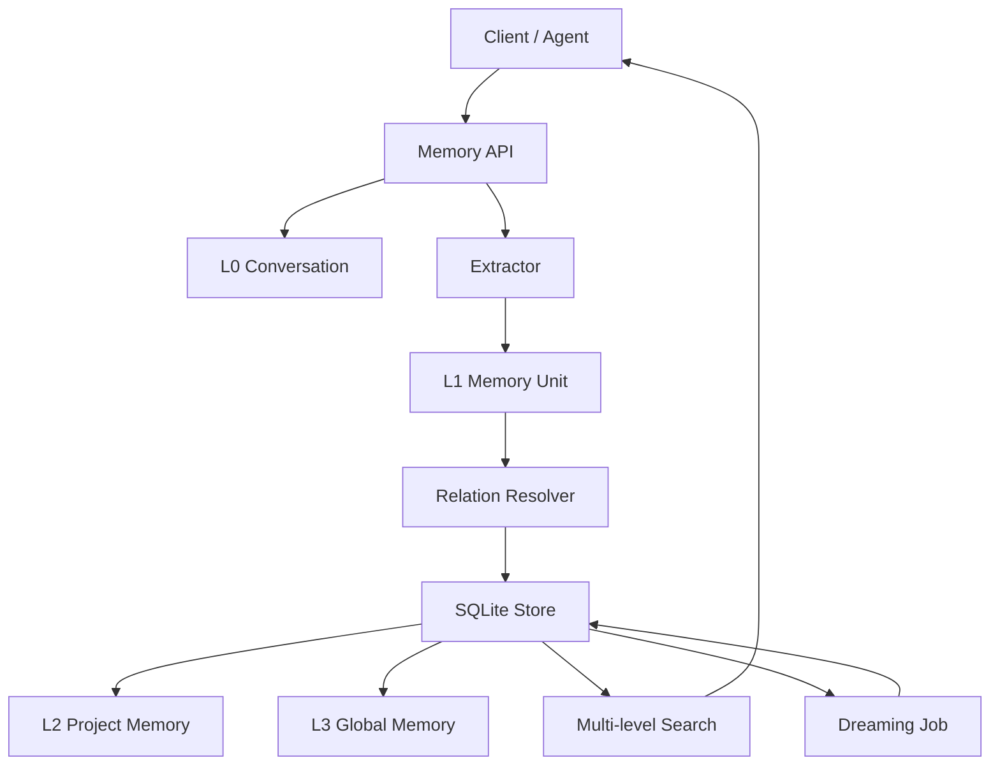

# oh-my-memory

一个本地 Memory 服务原型。

它不是简单的向量检索库，而是尝试把记忆建模成会演化的事实系统：写入时抽取和演化，离线时压缩和晋升，检索时多级召回并过滤旧事实。

## 功能

- L0：保存原始对话 turn
- L1：抽取最小记忆单元
- L2：按项目/主题聚合记忆
- L3：Dreaming 生成长期画像
- 支持 `active / superseded / deleted` 状态
- 支持 `supersedesId` 版本链
- 支持记忆关系：`duplicate / update / contradict / support / related`
- 支持按 `mis / source / agent / channel / metadata` 隔离
- 提供本地 HTTP API

## 架构



## 快速开始

```bash
npm install
npm run dev
```

默认启动：

```text
http://localhost:3000
```

可通过环境变量修改：

```bash
PORT=3001 MEMORY_DB_PATH=memory.sqlite npm run dev
```

## API 示例

### 健康检查

```bash
curl -s http://localhost:3000/health
```

### 写入对话

```bash
curl -s http://localhost:3000/turns \
  -H 'content-type: application/json' \
  -d '{
    "sessionId": "s1",
    "role": "user",
    "content": "项目 A 使用 MySQL",
    "mis": "u1",
    "source": "local",
    "agent": "demo",
    "channel": "default",
    "metadata": {}
  }'
```

再次写入更新事实：

```bash
curl -s http://localhost:3000/turns \
  -H 'content-type: application/json' \
  -d '{
    "sessionId": "s1",
    "role": "user",
    "content": "项目 A 已迁移到 PostgreSQL",
    "mis": "u1",
    "source": "local",
    "agent": "demo",
    "channel": "default",
    "metadata": {}
  }'
```

此时旧的 `MySQL` 记忆会变成 `superseded`，新的 `PostgreSQL` 记忆保持 `active`。

### 检索记忆

```bash
curl -s http://localhost:3000/search \
  -H 'content-type: application/json' \
  -d '{
    "query": "项目 A 数据库",
    "mis": "u1",
    "source": "local",
    "agent": "demo",
    "channel": "default",
    "metadata": {}
  }'
```

默认只返回 `active` 记忆。

### 查看记忆

```bash
curl -s 'http://localhost:3000/memories?mis=u1&source=local&agent=demo&channel=default'
```

### 修改记忆状态

```bash
curl -s -X PATCH http://localhost:3000/memories/<memory-id> \
  -H 'content-type: application/json' \
  -d '{ "status": "deleted" }'
```

### 查看记忆关系

```bash
curl -s http://localhost:3000/memories/<memory-id>/relations
```

### 运行 Dreaming

```bash
curl -s -X POST http://localhost:3000/dreaming/run \
  -H 'content-type: application/json' \
  -d '{
    "mis": "u1",
    "source": "local",
    "agent": "demo",
    "channel": "default",
    "metadata": {}
  }'
```

## 当前抽取规则

MVP 暂不接真实模型，使用规则抽取：

```text
项目 X 使用 Y
项目 X 用的是 Y
项目 X 已迁移到 Y
我喜欢 X
我偏好 X
决定 X
决策 X
```

噪音示例：

```text
你好
谢谢
好的
ok
```

## 开发命令

```bash
npm test
npm run typecheck
```

## 项目结构

```text
src/domain/
  extractor.ts       规则抽取
  resolver.ts        去重、更新、关系判定
  project-memory.ts  L2 聚合
  dreaming.ts        L3 晋升
  search.ts          多级检索
  text.ts            文本相似度工具
  types.ts           领域类型

src/storage/
  database.ts        SQLite schema
  repositories.ts    存储访问

src/server.ts        Fastify API
src/index.ts         服务入口
tests/               行为测试
```

## MVP 边界

已做：

- L0/L1/L2/L3 数据结构
- 规则抽取
- 价值筛选
- supersede 演化
- memory relation
- project 聚合
- Dreaming 晋升
- 多级检索 API
- 单元测试

暂不做：

- Time Memory
- 真实 Embedding
- 真实 LLM 抽取
- Reranker
- 前端管理页
- 复杂知识图谱

## 设计文档

- [设计文档](docs/superpowers/specs/2026-05-27-oh-my-memory-design.md)
- [实现计划](docs/superpowers/plans/2026-05-27-oh-my-memory.md)
