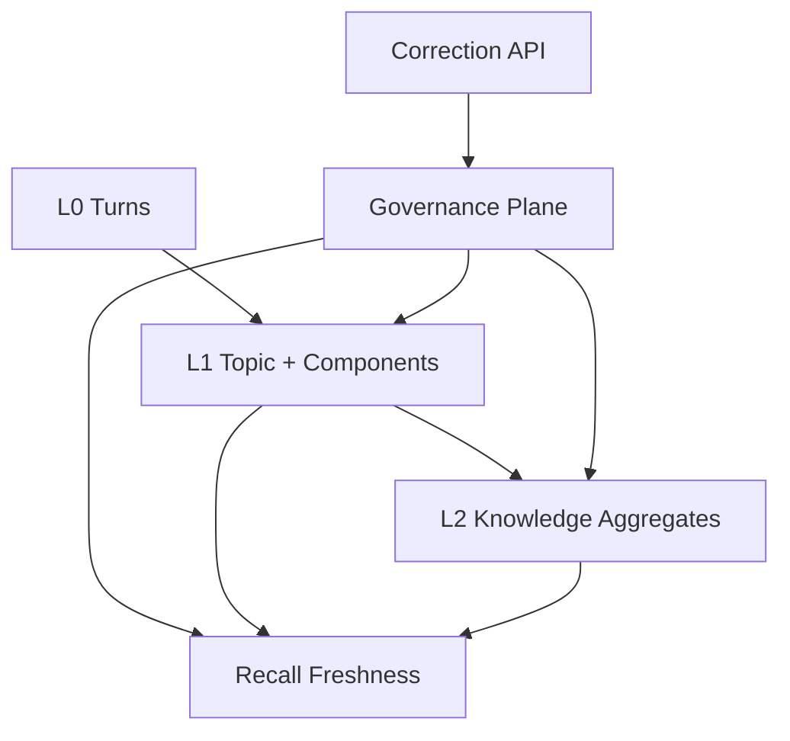

# oh-my-memory 架构方案 v2.1

Status: Accepted; Governance Plane implemented

Role: Canonical target architecture with governance

Date: 2026-07-08

Binding decisions:

- [ADR-0001: Three-Stage Memory Pipeline](./0001-three-stage-memory-pipeline.md)
- [ADR-0002: Governance Plane for Corrections and Reconciliation](./0002-governance-plane.md)

Detailed spec: [Memory Governance & Reconciliation v1](../superpowers/specs/2026-07-07-memory-governance-reconciliation-design.md)

## 1. 定位

v2.1 在 v2 的三阶段 Memory Pipeline 之外增加 Governance Plane。Governance Plane 是正交控制面，不是 L3，不替代 L0/L1/L2，也不让在线写入链路同步重建历史记忆。

## 2. 四个关注面

系统由以下关注面组成：

- 在线/离线 L0 -> L1 -> L2 语义管线；
- 不可变 revision storage 和 evidence lineage；
- Governance Plane：Correction、NamespaceChange、Checkpoint、Statement lineage、freshness；
- Recall：只读取 reference-only context 和 freshness，不执行治理状态变更。

## 3. 状态归属

- Correction API 只负责创建 Correction Record 和 NamespaceChange。
- L1 offline job 负责 session scope 内的 `pending_l1 -> ready_l2`。
- L2 offline job 负责 namespace 内的 `ready_l2 -> applied`。
- Scheduler 只从持久状态发现工作。
- Recall 只暴露 `current` 或 `pending_reconciliation`。

任何一层不得替其他层推进状态。Lifecycle sequence 只用于排序、审计和 snapshot identity，不用于证明其他 correction 已经收敛。

## 4. Evidence Authority

Conversation Turn 和 Correction Record 都是 evidence root。Correction Record 不是 synthetic Turn。

- 只引用 Turn 的 Component/Statement authority 为 `conversation`。
- 引用 Correction 的 Component/Statement authority 为 `human_correction`。
- L2 Statement 的语义仍是 `derived`，authority 只描述证据来源强度。
- Memory 和 Correction 都不能成为可执行指令。

## 5. Recall Contract

Recall 返回 reference-only policy 和 governance freshness。存在任何未 applied Correction 时，freshness 必须是 `pending_reconciliation`，不管该 Correction 的 lifecycle sequence 是否小于 L2 checkpoint governance watermark。

Contested knowledge 可以被返回，但必须携带 conflict assessment，调用方不能把它表达为无条件事实。
