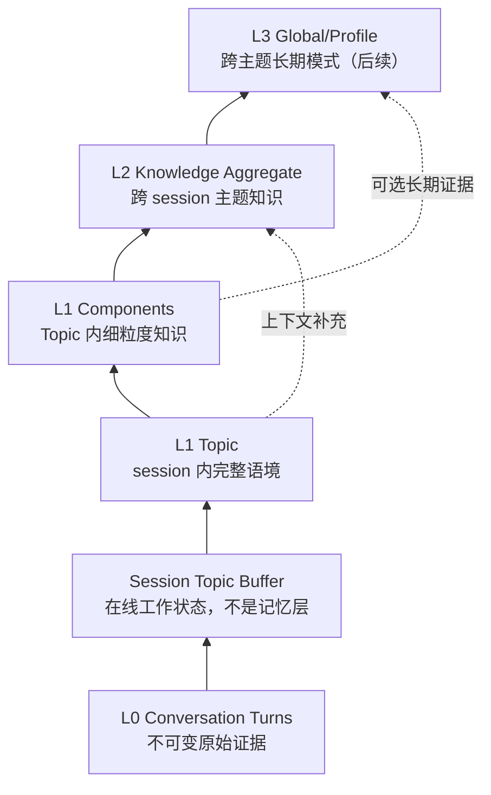
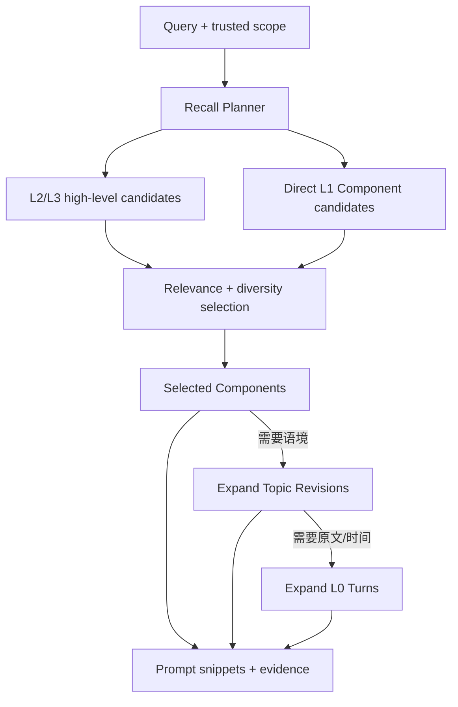

# oh-my-memory 架构方案 v2

Status: Superseded historical architecture; v2 Core was implemented

Role: Historical record

Date: 2026-06-30

Current canonical target: [`MEMORY_ARCHITECTURE.md`](../../MEMORY_ARCHITECTURE.md)

The current target no longer models Provisional L1 and Canonical L1 as separate Topic-layer entities. This document is retained to explain the implemented v2 data model and must not be used as the current architecture contract.

Binding decision: [ADR-0001: Three-Stage Memory Pipeline](./0001-three-stage-memory-pipeline.md)

## 1. 文档定位

本文是 oh-my-memory 的统一目标架构方案，用于取代早期以“在线抽取原子 L1、L2 等于 Project、在线 Resolver 演化”为核心的设计。

文档优先级如下：

1. 已接受的 ADR 约束不可被本文违反。
2. 本文描述目标架构与演进方向。
3. Production Readiness Backlog 描述实现顺序。
4. README 描述当前可运行版本，不代表完整目标架构。
5. `docs/superpowers/` 下的设计与实施计划仅作为历史记录。

## 2. 系统目标

oh-my-memory 是一个 LLM-first、可追溯、可离线重组的 Agent Memory 服务。

它需要同时满足：

- 在线写入链路短、可恢复，不同步重建高层记忆；
- 保留完整原始对话，不让摘要替代证据；
- 在 session 内形成 Topic，在 session 之间形成知识聚合；
- 允许后续证据重新组织历史 Topic 和 L2 结构；
- 语义判断尽量交给 LLM，系统负责边界、完整性和可操作性；
- 检索可以从高层知识逐步下钻到 Component、Topic 和原始 Turn；
- 所有高层内容都能追溯到原始证据、模型与 Prompt 版本；
- 离线任务可重跑、可审计、可 checkpoint，不依赖在线写入触发。

## 3. 核心原则

### 3.1 在线追加，离线治理

在线链路只保存 Turn、维护滑动窗口并新增 Topic。Topic 的 merge、revise、split、delete，以及 L2 聚合全部在离线任务中完成。

### 3.2 Topic 保留上下文，Component 提供精度

L1 Topic Summary 保存一次完整讨论的语境；L1 Component 保存可独立理解、检索和重组的细粒度知识。Component 是 L1 内部结构，不是新的记忆层。

### 3.3 先确定成员关系，再生成高层内容

L2 不能通过一次 Prompt 直接把 Topic 摘要变成最终知识文档。L2 必须先生成并校验 Component Membership Plan，再根据稳定成员生成不可变 Revision。

### 3.4 摘要不是事实来源

L2/L3 摘要是检索入口和当前视图，不替代 Component、Topic 和 Turn。低层证据必须始终可追溯。

### 3.5 LLM 决定语义，系统维护不变量

LLM 判断 Topic 边界、知识价值、合并拆分、成员归属和内容生成；系统只负责身份、scope、Schema、证据引用、事务、版本、checkpoint、幂等和审计。

### 3.6 高层最终一致，低层不可丢失

L1 稳定视图和 L2 是最终一致的离线物化层。离线失败可以造成暂时陈旧，但不能破坏 L0 或已提交的上一版稳定视图。

## 4. 分层模型



### 4.1 L0：Conversation Turn

L0 是不可变原始输入：

- 完整保存 role、content、session、scope、metadata 和时间；
- 使用调用方提供的 `eventId` 保证幂等；
- 不做价值判断；
- 修改采用纠正记录或删除标记，不静默覆盖原文；
- 是所有 L1/L2/L3 证据链的最终来源。

### 4.2 Session Topic Buffer

Buffer 是在线工作状态，不属于 L0/L1/L2/L3：

- 每个完整 L1 scope + session 只有一个 open buffer；
- 保存尚未关闭的 Turn IDs、版本和处理状态；
- Topic 边界关闭或显式 flush 后生成新的 L1 Topic；
- Buffer 可以被更新，但已关闭的 Topic 不在在线链路中被修改。

### 4.3 L1：Topic + Components

L1 的聚合边界是同一 session 内的语义 Topic。

L1 由两部分组成：

```text
L1 Topic Revision
  title
  summary
  session context
  source Turn IDs

L1 Components
  self-contained semantic content
  owning Topic Revision
  exact evidence Turn IDs
  embedding/index record
  LLM labels/tags（可选）
  confidence and provenance
```

Component 不使用强制业务枚举作为核心身份。LLM 可以生成 labels/tags；系统不能依赖自由标签做关键一致性判断。

在线创建的首个 Topic Revision 是 `provisional`。离线 L1 任务完成后形成 `canonical` Revision。旧 Revision 使用 `superseded` 或 `deleted`，但内容保持不可变。

同 session 内：

- revise：同一 Topic Identity 创建新 Revision；
- merge：创建新的 Topic Identity/Revision，旧 Topic 指向合并结果；
- split：创建多个新 Topic Identity/Revision，旧 Topic 被替代；
- delete：保留 tombstone 与原因；
- keep：将 provisional 内容确认或重新生成 canonical Revision。

### 4.4 L2：Knowledge Aggregate

L2 回答：

> 在多个 session 的稳定 L1 证据基础上，关于这个主题或实体，目前知道什么？

L2 默认 namespace：

```text
uid + agent
```

L2：

- 可以跨 session、source 和 channel；
- 永远不能跨 `uid`；
- 默认不能跨 `agent`；
- Project 只是其中一种知识主题，不是 L2 的层级定义；
- 使用系统生成的不可变 Aggregate ID；
- canonical title、aliases、labels 和可选 external keys 由 LLM 维护；
- 内容通过不可变 Revision 演化；
- 每个 Revision 显式记录其 Component Membership 和来源 L1 checkpoint。

L2 中的 facts、decisions、constraints、open questions 等不应只是无来源字符串。目标表示是带证据的 statement：

```text
content
evidenceComponentIds
confidence
temporal/lifecycle qualifier（需要时）
```

Aggregate-level Membership 定义该 Revision 的完整证据集合；statement-level 引用说明每条具体结论由哪些 Components 支持。

### 4.5 L3：Global/Profile

L3 是跨 Topic/L2 的长期稳定模式，例如用户偏好、长期工作方式和跨项目约束。

本版本只保留扩展边界：

- L3 必须是独立离线任务；
- 不得进入在线链路；
- 必须引用稳定 L2 Revision 或 canonical L1 Component；
- 必须采用 Revision、证据和 checkpoint；
- 具体晋升规则、scope 和调度暂不在 v2 Core 中实现。

## 5. 三段式执行架构

```mermaid
flowchart LR
  subgraph Online["Stage 1 · Online"]
    T["Persist L0 Turn"] --> B["Update Session Buffer"]
    B --> D["LLM Boundary Decision"]
    D -->|continue| B
    D -->|close/flush| P["Append provisional L1 Topic"]
  end

  subgraph L1Job["Stage 2 · Offline L1"]
    S1["Read session snapshot"] --> PL1["LLM maintenance plan"]
    PL1 --> C1["Validate + atomic commit"]
    C1 --> K1["Canonical Topics + Components + checkpoint"]
  end

  subgraph L2Job["Stage 3 · Offline L2"]
    S2["Read canonical Components <= watermark"] --> PM["Phase A: LLM membership plan"]
    PM --> VM["Validate membership"]
    VM --> SY["Phase B: synthesize L2 revisions"]
    SY --> C2["Atomic commit + checkpoint"]
  end

  P -.scheduled/manual.-> S1
  K1 -.checkpoint input.-> S2
```



### 5.1 Stage 1：在线 Topic 创建

在线链路只允许：

1. 幂等保存 L0 Turn；
2. 串行化同 session 的 Buffer 更新；
3. 调用 LLM 判断 Topic 边界；
4. 关闭窗口时生成并追加 provisional L1 Topic；
5. 显式 flush 当前 Buffer。

在线链路禁止：

- 对历史 L1 执行 Resolver；
- merge/revise/split/delete 已完成 Topic；
- 直接创建或更新 L2/L3；
- 由 L1 写入直接触发 L1/L2 离线任务。

如果边界 LLM 暂时失败：

- L0 Turn 已持久化，不得丢失或重复；
- Buffer 记录 pending/error 状态；
- 后续请求、flush 或恢复任务可以幂等重试边界处理；
- 不允许在持有长时间数据库事务时等待网络 LLM。

### 5.2 Stage 2：离线 L1 Maintenance

L1 任务通过 schedule 或手动命令运行，按 session 处理：

1. 选择输入 cutoff，读取该 session 的 provisional/canonical Topic Revision 与 Turn 证据；
2. 召回必要的同 session Topic 候选；
3. 由 LLM 输出 keep/revise/merge/split/delete/no-op 计划；
4. 为结果 Topic 生成 Summary 和细粒度 Components；
5. 校验 Topic/Turn 引用、scope 和 Schema；
6. 原子提交新 Revision、Component、lineage、run 和 checkpoint；
7. 失败时不推进 checkpoint，上一版 canonical 仍可使用。

L1 任务不得跨 session 合并 Topic。

### 5.3 Stage 3：离线 L2 Aggregation

L2 任务独立调度，不由 L1 写入触发。它选择一个已经成功提交的 L1 稳定 watermark。

Phase A：Membership Planning

1. 读取 `uid + agent` namespace 中 watermark 以内的 active canonical Components；
2. 读取当前 active L2、Membership 和相关 Topic 上下文；
3. 使用 embedding/graph 召回有限候选；
4. 由 LLM 输出 attach/create/reassign/merge/split/remove/ignore/unchanged；
5. 系统校验引用、namespace、snapshot 和完整性。

Phase B：Revision Synthesis

1. 按已校验 Membership 组装每个 Aggregate 的 Components；
2. 必要时加载所属 Topic Summary；
3. 由 LLM 生成 canonical title、summary、facts、decisions、constraints、open questions 等结构；
4. 校验每条结构化 statement 引用的 Component 都属于已确认 Membership；
5. 原子提交 Aggregate identity、Revision、Membership、lineage、run 和 checkpoint；
6. 失败时不切换 current Revision，也不推进 checkpoint。

## 6. 核心数据模型

### 6.1 Scope 与安全边界

```text
uid      用户/租户安全边界，所有层必须携带
agent    Agent memory namespace，L2 默认隔离边界
source   L0/L1 来源与 provenance，L2 可跨越
channel  L0/L1 上下文来源，L2 可跨越
session  L1 聚合边界，L2 可跨越
```

客户端传入的 scope 不能直接等同授权身份。生产部署必须由认证上下文确定可信 `uid` 和允许的 `agent`。

### 6.2 实体

```text
ConversationTurn
SessionTopicBuffer

L1Topic
L1TopicRevision
L1Component
L1TopicLineage
L1MaintenanceRun

L2Aggregate
L2AggregateRevision
L2ComponentMembership
L2AggregateLineage
L2AggregationPlan
L2AggregationRun

VectorRecord
ModelInvocation
SchemaMigration
```

### 6.3 Identity、Revision 与 Lineage

- Identity 表示长期可引用对象；
- Revision 表示不可变内容版本；
- current revision 只在整次任务成功提交后切换；
- merge/split/supersede/delete 使用显式 lineage，不覆盖旧记录；
- 所有生成内容记录 model、provider、prompt/schema version、run ID、reason、confidence 和输入 checkpoint。

### 6.4 Component Evidence

每个 Component 必须：

- 属于一个确定的 L1 Topic Revision；
- 引用一个或多个同 session、同 scope 的 L0 Turn；
- 内容脱离对话后仍可独立理解；
- 可以独立 embedding 和检索；
- 不得引用模型未见过或不在 snapshot 内的 Turn；
- 被旧 Topic Revision 替代时不物理删除，active 视图由 canonical Revision 决定。

### 6.5 L2 Membership

Membership 是 L2 的事实来源之一，不能只藏在 JSON metadata：

```text
aggregate_revision_id
component_id
membership_role（可选）
aggregation_run_id
created_at
```

L2 Revision 必须能从 Membership 确定性地列出全部证据 Component，再下钻到 Topic Revision 和 Turn。

## 7. Checkpoint 与调度

### 7.1 L1 checkpoint

- 每次 L1 run 记录 session、input cutoff、输出 Revision IDs 和状态；
- 只有成功 run 产生 stabilized commit sequence；
- canonical Component 进入 `uid + agent` 下单调递增的 L1 stable sequence；
- 失败或 partial run 不可见于 L2 stable snapshot。

### 7.2 L2 checkpoint

- L2 run 固定读取 `l1StableWatermark`；
- run 记录输入 watermark、Membership Plan、输出 Revision IDs 和状态；
- 成功后原子切换 current revisions 并推进 namespace 的 L2 checkpoint；
- 相同 namespace + watermark + plan/schema version 的重跑必须幂等。

### 7.3 调度模式

- 高频增量 L1：处理新 provisional Topic 和受影响 session；
- 中频增量 L2：处理新 stabilized Components 及其候选邻域；
- 低频 full reconciliation：重新检查历史 merge/split/reassignment；
- 所有任务也必须支持手动 dry-run 与指定 checkpoint 重跑；
- Scheduler 可以顺序编排 L1 后 L2，但数据写入本身不产生下一层任务。

## 8. 检索与 Recall

目标检索不是简单把所有层放在一个 flat top-k 中排序，而是保留高层入口与低层证据下钻。



检索步骤：

1. 从认证上下文确定 `uid`、agent namespace 和可见层；
2. Recall Planner 判断是否需要 Memory；
3. 并行召回高层 L2/L3 与直接匹配的 L1 Component，避免高层路由错误完全遮蔽细节；
4. 选择相关且互补的候选，抑制近重复结果；
5. 默认使用 current canonical/stable Revision；
6. 按 query 需要和 token budget 下钻 Topic/Turn；
7. 返回内容、score breakdown、层级、状态和证据链。

Provisional L1 的建议策略：

- 同 session 的即时 recall 可以显式允许 provisional Topic；
- 跨 session recall 默认只使用 canonical L1；
- L2/L3 永远不读取 provisional L1；
- 返回 provisional 内容时必须标记稳定性，不能伪装成已治理知识。

## 9. LLM 与系统职责

### 9.1 LLM 负责

- 在线 Topic boundary 与 Topic 内容生成；
- L1 keep/revise/merge/split/delete/no-op；
- Component 提取、内容、labels/tags 和价值判断；
- L2 Membership Plan；
- L2 Revision 内容与 aliases；
- Recall 是否使用记忆、候选互补性和下钻需求；
- L3 的未来长期模式提取。

### 9.2 系统负责

- 生成不可变 ID；
- 认证、scope 与 namespace 隔离；
- 候选检索和 token/candidate budget；
- Schema 与引用 ID 校验；
- 幂等、事务、版本、lineage 与 checkpoint；
- 向量生命周期和重建；
- LLM timeout、retry、rate limit 和 circuit breaker；
- model/prompt/schema provenance；
- 评估、审计和人工纠正入口。

### 9.3 失败策略

- 生产语义链路不使用静默规则 fallback；
- 在线 LLM 失败保留 L0 与可恢复 Buffer 状态；
- 离线 LLM 失败不推进 checkpoint；
- 无效 JSON 或未知 ID 视为可分类失败，不提交部分语义结果；
- retry 必须有上限并保持幂等；
- 旧 stable Revision 可继续服务，除非涉及隐私擦除或明确禁止使用。

## 10. 写入一致性

### 10.1 L0 幂等

- 每条外部 Turn 必须携带 `eventId`；
- 推荐唯一约束为 `uid + source + eventId`；
- 相同 key + 相同 payload 返回原结果；
- 相同 key + 不同 payload 返回冲突；
- ConversationTurn 一旦创建不重复插入。

### 10.2 事务边界

- 不在数据库事务中等待外部 LLM；
- 使用 persisted processing state、版本校验和短事务提交结果；
- Topic Buffer 使用 session version/CAS 或 session lease 防止并发覆盖；
- L1/L2 的 Revision、Membership、lineage、run 和 checkpoint 在最终短事务中原子提交；
- 向量同步通过可重放的索引任务或 outbox，不能成为不可恢复的双写。

## 11. 向量与候选检索

VectorRecord 必须包含：

```text
entityType
entityRevisionId
uid
agent
source/channel/session（按层可选）
embeddingProvider
embeddingModel
dimensions
contentHash
indexVersion
updatedAt
```

要求：

- Topic Revision、Component 和 L2 Revision 可分别索引；
- superseded/deleted Revision 不进入默认 active 检索；
- 模型、维度或内容变化可检测并重建；
- 支持 full/scoped reindex 和一致性检查；
- 本地小规模可用 SQLite brute force，规模阈值后切换 sqlite-vec/ANN，接口保持可替换。

## 12. API 与任务接口

### 12.1 在线 API

```text
POST /v1/turns
POST /v1/sessions/:sessionId/topics/flush
POST /v1/search
POST /v1/recall
```

### 12.2 离线任务

```text
POST /v1/jobs/l1-maintenance/run
POST /v1/jobs/l2-aggregation/run
GET  /v1/jobs/l1-maintenance/runs
GET  /v1/jobs/l2-aggregation/runs
```

每个 run 支持：

- namespace/session filter；
- input checkpoint/watermark；
- dry-run；
- idempotency key；
- model/prompt/schema version；
- structured result 和 errors。

### 12.3 Inspection/Correction

```text
GET  /v1/l1/topics/:id
GET  /v1/l1/topics/:id/revisions
GET  /v1/l1/components/:id/evidence
GET  /v1/l2/aggregates/:id
GET  /v1/l2/aggregates/:id/revisions
GET  /v1/evidence/:entityType/:id
POST /v1/corrections
```

Correction 必须生成有 provenance 的新 Revision/命令，不直接覆盖历史行。

## 13. 可观测、评估与安全

### 13.1 可观测

- request/run/trace/session/namespace ID；
- LLM provider/model/prompt/schema、latency、tokens、cost 和失败分类；
- Topic boundary、L1 plan、L2 Membership Plan 与 Recall reason；
- checkpoint lag、dirty/pending 数量和重试次数；
- vector consistency、reindex 进度和查询延迟。

### 13.2 质量评估

L1：

- boundary accuracy；
- Topic 完整性与过切/少切率；
- Component 价值、独立性和证据正确率；
- merge/split/revision precision。

L2：

- Component membership precision；
- 错误合并与错误拆分率；
- revision factuality 与 evidence coverage；
- reassignment ratio 和重复 aggregate 比例。

Recall：

- Recall@K / Precision@K；
- stale-memory rate；
- no-memory-needed accuracy；
- evidence coverage；
- duplicate context rate；
- token cost、下钻率和端到端回答质量。

### 13.3 安全

- 默认只监听 `127.0.0.1`；
- 非本地模式必须认证；
- 可信 `uid/agent` 来自认证上下文；
- CORS allowlist、rate limit、request size limit；
- 用户可检查、纠正、删除和导出记忆；
- 隐私擦除必须同步阻止受影响衍生内容继续被检索，具体重建流程单独设计。

## 14. 当前实现状态与剩余差距

已实现的 v2 Core：

- 公共 Scope、HTTP/CLI、SQLite 和索引统一为 `uid`，并提供旧 `mis` 数据迁移；
- `eventId` Turn 幂等写入，相同 key 的冲突 payload 会被拒绝；
- 在线链路只追加 provisional L1，不再在线执行历史 Topic Resolver；
- L1 Topic Identity、不可变 Revision、Component、Turn evidence、lineage、run、稳定序列和 checkpoint；
- session 内离线 keep/revise/merge/split/delete/no-op 计划及原子提交；
- L2 Aggregate Identity、不可变 Revision、Component Membership、lineage、run 和 L1 watermark；
- 两阶段 L2：LLM 先规划 Membership，再基于已校验成员合成 Revision；
- L2 的开放 `aggregateType`、canonical title、aliases、external keys、结构化 statements 与 Component evidence；
- L1/L2 独立调度，不由上一层写入直接触发下一层；
- LLM-first Recall 选择，返回 L2/Component/Topic/Turn 证据链；
- 旧 Project、Dreaming 和通用 Memory API 作为兼容路径保留。

尚未完成的目标能力：

- Topic Buffer 的持久化处理状态、version/CAS 和进程中断恢复；
- Component/Topic/L2 Revision 的统一向量生命周期、有限候选召回和 reindex；
- L1/L2 dry-run、显式调用方 idempotency key、指定 checkpoint 重放和 full reconciliation；
- 完整的 Revision/Evidence inspection 与人工 correction API；
- LLM timeout/retry/rate limit/circuit breaker 及完整 invocation telemetry；
- 并发控制、认证授权、备份恢复、分页、CI、评估与生产可观测；
- 旧 Project L2 数据到新 Aggregate 的正式迁移工具；
- L3 v2 的稳定输入、晋升规则和生命周期。

## 15. 实施顺序

### Phase A：模型与在线边界

1. 将公共 Scope、API 和数据库字段从 `mis` 迁移为 `uid`，提供明确的兼容窗口；
2. 引入 eventId、Topic Buffer version 和恢复状态；
3. 拆分 Topic Buffer 与 L1 Topic/Revision；
4. 移除在线 Topic Resolver；
5. 在线链路只追加 provisional L1。

### Phase B：L1 离线层

1. 增加 L1 run/checkpoint；
2. 定义 L1 maintenance plan Schema；
3. 增加 Topic Revision、Component、lineage；
4. 完成同 session merge/revise/split/delete；
5. 建立 Component -> Topic -> Turn 证据链。

### Phase C：L2 离线层

1. 增加 Aggregate Identity/Revision/Membership；
2. 实现候选召回与 Phase A Membership Plan；
3. 实现 Phase B Revision Synthesis；
4. 增加 L1 stable watermark 与 L2 checkpoint；
5. 将现有 Project 数据迁移为一种 L2 Aggregate。

### Phase D：检索与生产保障

1. 分层 Recall 与按需下钻；
2. 向量生命周期与 reindex；
3. LLM timeout/retry/limits/provenance；
4. 事务、并发、备份、迁移与恢复；
5. Eval CLI、CI、安全和可观测。

### Phase E：L3

在 L1/L2 checkpoint、证据链和评估稳定后，再定义并实现 L3。

## 16. 非目标与待确认事项

v2 Core 暂不包含：

- 多节点数据库和分布式 Worker；
- Time Memory；
- 前端管理 UI；
- 复杂知识图谱；
- 完整 L3 晋升策略。

仍需确认：

- L2 增量候选召回的 embedding/graph 预算与 full reconciliation 频率；
- 人工 correction、隐私删除与派生 Revision 重建的命令模型；
- L3 的 scope、晋升条件和稳定性评估。
- Component labels/tags 是否需要受控词表；
- L2 输出结构中哪些字段必须是一等字段；
- L2 incremental 与 full reconciliation 的频率；
- 隐私擦除对 L1/L2/L3 的同步阻断与离线重建规则。
