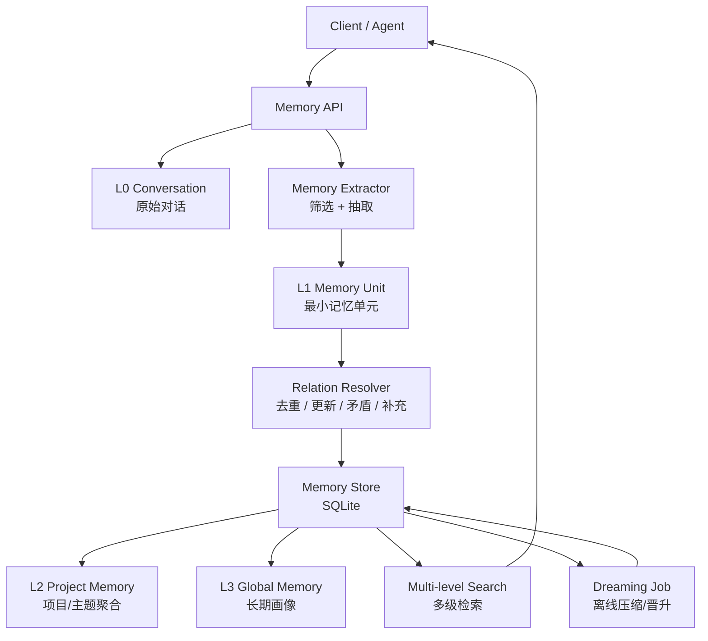
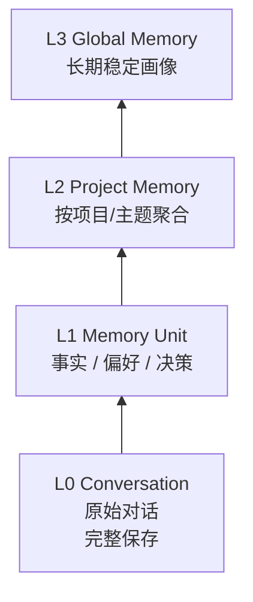
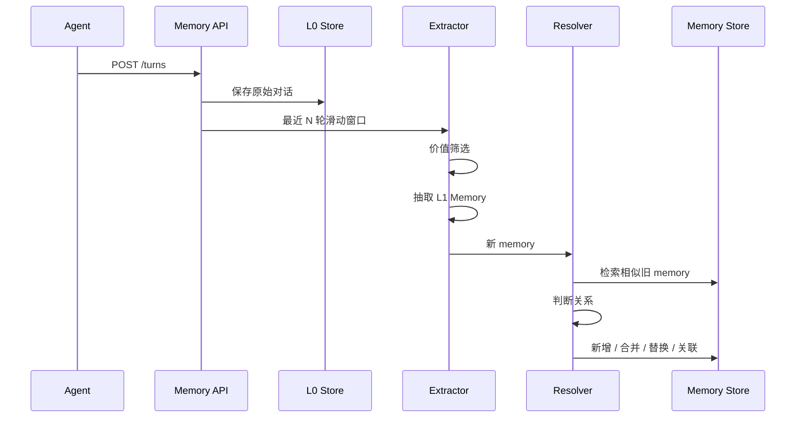
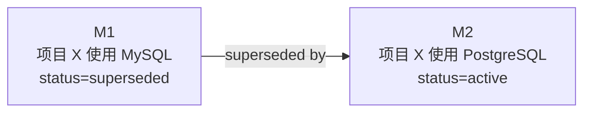
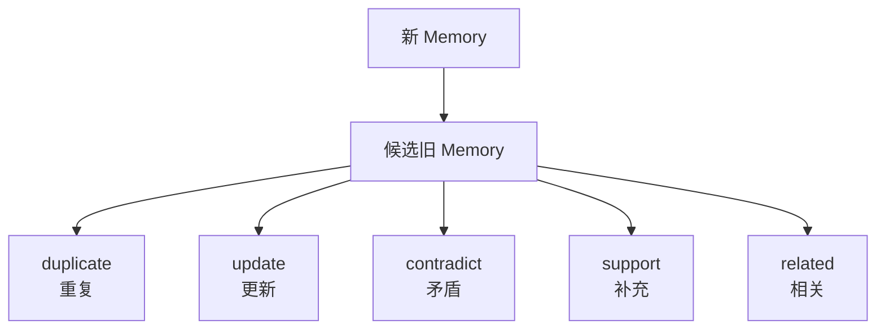
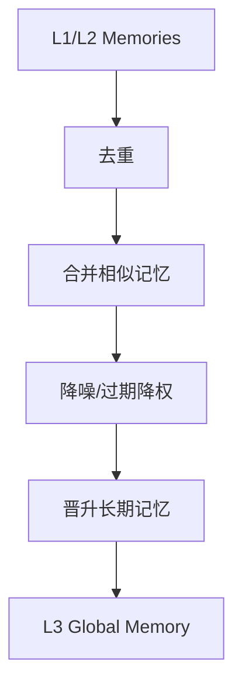
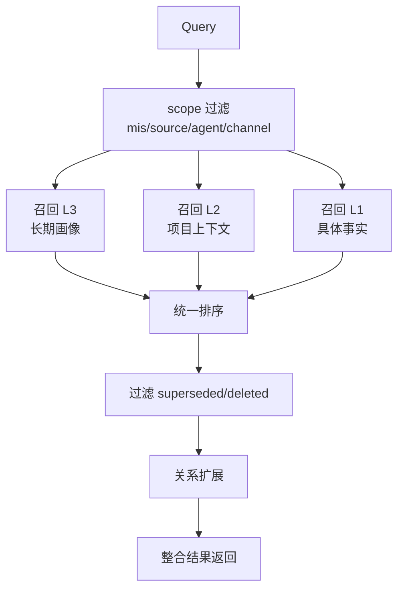

# oh-my-memory 设计 v1

Status: Superseded historical design

Current target: [`MEMORY_ARCHITECTURE.md`](../../../MEMORY_ARCHITECTURE.md)

This document preserves the original MVP design and is not authoritative for new implementation work.

## 目标

实现一个本地 Memory 服务。它不是简单检索库，而是支持记忆筛选、事实演化、关联关系、自动压缩、多级检索和多维隔离的记忆系统。

MVP 不做独立 Time Memory，但保留时序字段和 supersede 版本链。

## 总体架构



## 记忆分层



- L0：保存原始 turn，不判断价值。
- L1：从对话中抽取最小记忆。
- L2：把同项目、同主题的 L1 聚合。
- L3：长期、稳定、高价值的用户画像。

## 核心实体

### ConversationTurn

```text
id
session_id
role
content
mis
source
agent
channel
metadata
created_at
```

### Memory

```text
id
level: L1 | L2 | L3
type: fact | preference | decision | profile | project
subject
predicate
object
summary
confidence
status: active | superseded | deleted
supersedes_id
source_turn_ids
mis/source/agent/channel/metadata
created_at
updated_at
```

### MemoryRelation

```text
from_memory_id
to_memory_id
relation_type: duplicate | update | contradict | support | related
confidence
created_at
```

## 写入流程



写入时做四件事：

```text
过滤噪音
抽取事实
查找旧记忆
处理演化关系
```

## 价值筛选

不入库：

```text
你好
谢谢
纯情绪
临时闲聊
无主体、无未来价值内容
```

入库：

```text
用户偏好
项目事实
技术决策
长期约束
身份信息
工作习惯
反复出现的问题
```

## 记忆演化



规则：

```text
同主体 + 同属性 + 新值
=> 旧记忆 superseded
=> 新记忆 active
=> 建立 supersedes 链
```

检索默认只返回 active。需要历史时再带版本链。

## 关系模型



判定依据：

```text
scope 是否一致
subject 是否相同
predicate 是否相同
object 是否冲突
关键词相似度
metadata 匹配度
时间新旧
```

## Project Memory

L2 是主题聚合结果。

示例 L1：

```text
项目 A 使用 PostgreSQL
项目 A 后端是 Node.js
项目 A 需要本地优先
```

聚合为：

```text
项目 A：
数据库 PostgreSQL，后端 Node.js，偏本地优先。
```

L2 可由写入时增量更新，也可由 Dreaming 重建。

## Dreaming



Dreaming 目标：

```text
减少重复
保留当前事实
沉淀长期偏好
生成用户画像
```

晋升规则：

```text
高频
稳定
跨 session 出现
未来回答有价值
不是临时事实
```

## 检索流程



排序公式：

```text
score =
  keyword_score
+ semantic_score
+ level_weight
+ recency_score
+ confidence
+ scope_match
- stale_penalty
```

优先级：

```text
当前事实 > 历史事实
L3/L2 背景 > L1 细节
高置信 > 低置信
同 scope > 跨 scope
```

## API

```text
POST /turns
写入一轮对话

POST /search
检索记忆

GET /memories
查看记忆

PATCH /memories/:id
修改/删除记忆

GET /memories/:id/relations
查看关系

POST /dreaming/run
执行压缩和晋升
```

## 技术选型

```text
Node.js + TypeScript
Fastify
SQLite
Drizzle ORM
Vitest
```

MVP 不接真实模型：

```text
抽取：规则引擎
相似度：关键词/Jaccard
压缩：模板归纳
embedding：预留接口
```

后续替换：

```text
LLM extractor
Embedding model
Reranker
Graph search
管理页面
```

## MVP 边界

做：

```text
L0/L1/L2/L3 数据结构
写入抽取
价值筛选
supersede 演化
memory relation
project 聚合
dreaming 压缩
检索 API
单元测试
```

不做：

```text
Time Memory
真实 Embedding
真实 LLM 抽取
前端管理页
复杂知识图谱
```

## 核心原则

```text
写入时抽取和演化。
离线时压缩和晋升。
检索时多级召回并过滤旧事实。
```
