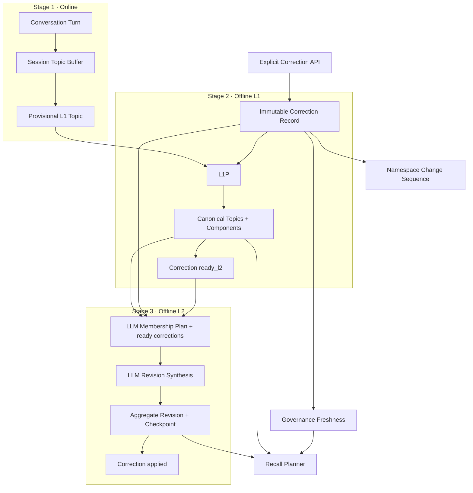

# Memory Governance & Reconciliation v1

Status: Proposed for review

Date: 2026-07-07

Depends on:

- [oh-my-memory Architecture v2](../../architecture/oh-my-memory-architecture-v2.md)
- [ADR-0001: Three-Stage Memory Pipeline](../../architecture/0001-three-stage-memory-pipeline.md)

## 1. Document Role

This specification adds a governance control plane to the existing L0/L1/L2 architecture. It defines explicit human correction, conflict preservation, eventual offline reconciliation, trustworthy recall metadata, real checkpoint-based scheduling, and pre-LLM idempotency.

It does not replace the three-stage pipeline. Governance is orthogonal to the memory layers and must not become a new memory layer or an online semantic reconciliation path.

## 2. Goals

The implementation must provide:

- explicit, idempotent human `retract` and `replace` corrections;
- immutable correction records with stable lifecycle state;
- correction evidence represented as a first-class governance evidence root rather than a synthetic Turn or untraceable metadata;
- propagation of correction authority through L1 Components and L2 Statements;
- eventual L1/L2 reconciliation without synchronously triggering either job;
- explicit Recall freshness while reconciliation is pending;
- stable L2 Statement identity and conflict status;
- L1/L2 task identity derived from the input snapshot rather than LLM output;
- schedulers that skip unchanged namespaces and rediscover work after restart;
- bounded semantic candidate sets while retaining LLM-first decisions;
- migration of existing v2 data without losing revisions or evidence.

## 3. Non-Goals

This specification does not implement:

- privacy erasure or physical evidence deletion;
- L3 memory;
- executable Policy, Skill, or system instruction storage;
- automatic promotion of natural-language conversation into an explicit correction;
- synchronous L1 or L2 execution from the correction request;
- deterministic semantic latest-wins rules;
- a full distributed worker or queue system;
- production authentication and authorization beyond the current namespace validation boundary.

Privacy erasure belongs to the Agent or a higher-level data-governance system and requires a separate design.

## 4. First-Principle Contract

The memory system exists to improve future decisions under uncertainty. Remembering more is not the objective by itself. A useful design must balance decision benefit against incorrect-memory harm, retrieval cost, and operational risk.

The following invariants are binding:

1. All L0/L1/L2 Memory is reference-only context. Memory never becomes an executable instruction.
2. Current explicit user input has higher conversational priority than historical Memory.
3. Explicit human correction has higher evidence authority than ordinary conversation and model-derived synthesis.
4. Higher abstraction does not imply higher truth authority.
5. Ordinary contradictory observations are preserved as conflict unless an explicit correction retracts an earlier claim.
6. Semantic decisions remain LLM-authored. The system enforces identity, scope, evidence, authority derivation, transactions, versions, checkpoints, candidate budgets, and lifecycle state.
7. Correction convergence is eventually consistent. Old Memory may remain recallable until the independent L1/L2 jobs incorporate the correction.
8. Pending reconciliation must be visible to Recall consumers; stale results must not be presented as fully current.

## 5. Architecture



Correction writes persistent work state only. The L1 and L2 schedulers discover that work independently. No correction data write invokes the next stage directly.

## 6. Core Types

### 6.1 Evidence References

```ts
export type EvidenceRef =
  | { kind: "turn"; id: string }
  | { kind: "correction"; id: string };
```

Conversation Turns and explicit Correction Records are parallel immutable evidence roots. A Correction is governance data, not an L0 Turn and not a fourth Memory layer.

For storage and validation, L1 Components expose `evidenceTurnIds` and `evidenceCorrectionIds`. At least one of the two lists must be non-empty. Existing Components keep their Turn evidence and migrate with an empty correction-evidence list.

### 6.2 Evidence Authority

```ts
export type EvidenceAuthority = "conversation" | "human_correction";
```

Authority is system-derived:

- an L1 Component that cites at least one valid Correction Record has `human_correction` authority;
- an L1 Component supported only by ordinary Turns has `conversation` authority;
- an L2 Statement is model-derived content and records `derived` as its own semantic origin while separately exposing the strongest supporting evidence authority;
- the LLM cannot output or elevate evidence authority;
- authority does not turn Memory into an instruction.

For clarity, L2 Statements use two fields:

```ts
semanticOrigin: "derived";
evidenceAuthority: "conversation" | "human_correction";
```

### 6.3 Statement Identity and Conflict

```ts
export type StatementStatus = "supported" | "contested";

export type StatementEvidenceRef =
  | { kind: "component"; id: string }
  | { kind: "correction"; id: string };

export interface ConflictAssessment {
  summary: string;
  supportingEvidenceRefs: StatementEvidenceRef[];
  conflictingEvidenceRefs: StatementEvidenceRef[];
  alternatives: string[];
}

export interface L2Statement {
  id: string;
  content: string;
  evidenceComponentIds: string[];
  evidenceCorrectionIds: string[];
  semanticOrigin: "derived";
  evidenceAuthority: "conversation" | "human_correction";
  status: StatementStatus;
  conflictAssessment: ConflictAssessment | null;
  confidence: number;
  qualifier?: string;
}
```

`L2Statement.id` identifies a logical Statement across Revisions. The containing Aggregate Revision ID identifies one immutable occurrence of that Statement. Identity control is system-owned:

- the LLM never supplies an output Statement ID;
- the system gives each synthesis input an opaque source reference bound to one Statement occurrence in the fixed snapshot;
- the LLM proposes a lineage operation using only those source references;
- the system preserves or allocates IDs according to the operation and records explicit lineage;
- historical occurrences remain immutable and auditable, but only a current occurrence can become a new correction target.

```ts
export interface StatementDraft {
  content: string;
  evidenceComponentIds: string[];
  evidenceCorrectionIds: string[];
  status: StatementStatus;
  conflictAssessment: ConflictAssessment | null;
  confidence: number;
  qualifier?: string;
}

export type StatementOperation =
  | { op: "continue"; sourceRef: string; statement: StatementDraft }
  | { op: "create"; statement: StatementDraft }
  | { op: "merge"; sourceRefs: string[]; statement: StatementDraft }
  | { op: "split"; sourceRef: string; statements: StatementDraft[] }
  | { op: "retire"; sourceRef: string };

export interface StatementLineageEdge {
  fromRevisionId: string;
  fromStatementId: string;
  toRevisionId: string | null;
  toStatementId: string | null;
  operation: "continue" | "merge" | "split" | "retire";
}
```

System identity rules:

- `continue` consumes exactly one source occurrence and preserves its logical Statement ID;
- `create` receives a new system-generated ID;
- `merge` consumes two or more source occurrences and receives one new ID;
- `split` consumes one source occurrence and every output receives a new ID;
- `retire` consumes one source occurrence and creates no successor;
- each source occurrence is consumed at most once in a synthesis commit;
- source references outside the fixed synthesis snapshot are rejected;
- sources from multiple Aggregates are allowed only when the system explicitly includes them in the same merge/reassignment synthesis scope.

The LLM still decides the semantic relationship. The system does not use text equality, similarity thresholds, or content hashes to decide identity. Its role is to constrain identity allocation and make every transition auditable.

Conflict status has the following operational meaning:

- `supported` means the active evidence supports one coherent current claim, or every previously conflicting branch has been explicitly resolved; `conflictAssessment` must be `null`;
- `contested` means active, valid evidence supports mutually incompatible current claims; `conflictAssessment` is required;
- `supportingEvidenceRefs` and `conflictingEvidenceRefs` must both be non-empty, disjoint, in scope, and present in the Statement's Component or Correction evidence;
- `alternatives` must contain at least two non-empty incompatible interpretations;
- temporally distinct claims may be represented as qualified Statements instead of `contested` when they are not incompatible within the same time scope.

Conflict detection is an LLM semantic decision over the bounded active evidence supplied to L2. There is no contradiction-count threshold: duplicated observations do not become independent truth merely through quantity. The system validates the conflict structure and evidence references, but does not infer semantic contradiction with deterministic rules.

### 6.4 Correction Record

```ts
export type CorrectionTargetType = "turn" | "l1_component" | "l2_statement";
export type CorrectionAction = "retract" | "replace";
export type CorrectionStatus = "pending_l1" | "ready_l2" | "applied";

export interface CorrectionRecord {
  id: string;
  eventId: string;
  uid: string;
  agent: string;
  targetType: CorrectionTargetType;
  targetId: string;
  targetRevisionId: string | null;
  action: CorrectionAction;
  correctedContent: string | null;
  reason: string;
  authority: "human_correction";
  status: CorrectionStatus;
  affectedSessionId: string | null;
  changeSequence: number;
  error: string | null;
  createdAt: string;
  updatedAt: string;
  appliedAt: string | null;
}
```

Initial status is determined as follows:

| Target | Action | Initial status | Reason |
| --- | --- | --- | --- |
| Turn | retract | `pending_l1` | Owning L1 session must remove its influence |
| Turn | replace | `pending_l1` | Owning L1 session must incorporate correction evidence |
| L1 Component | retract | `pending_l1` | Owning Topic must be revised |
| L1 Component | replace | `pending_l1` | Owning Topic must incorporate correction evidence |
| L2 Statement | retract | `ready_l2` | L2 can remove the derived claim directly |
| L2 Statement | replace | `ready_l2` | L2 consumes the Correction Record directly as authoritative evidence |

Corrections targeting a Turn or L1 Component follow `pending_l1 → ready_l2 → applied`. Corrections targeting an L2 Statement follow `ready_l2 → applied`; they never enter `pending_l1`. These transitions are performed only by the independent offline jobs that own the corresponding layer.

### 6.5 Namespace Change

```ts
export type NamespaceChangeKind =
  | "l1_revision"
  | "l1_delete"
  | "correction_created"
  | "correction_ready"
  | "correction_applied";

export interface NamespaceChange {
  sequence: number;
  uid: string;
  agent: string;
  kind: NamespaceChangeKind;
  entityType: string;
  entityId: string;
  correctionId: string | null;
  createdAt: string;
}
```

The sequence is database-generated and globally monotonic. Namespace queries use `max(sequence)` scoped by `uid + agent`.

### 6.6 L2 Checkpoint

```ts
export interface L2Checkpoint {
  uid: string;
  agent: string;
  l1StableWatermark: number;
  governanceWatermark: number;
  runId: string;
  promptVersion: string;
  schemaVersion: string;
  updatedAt: string;
}
```

The checkpoint advances only in the same transaction that commits all L2 Revisions and marks all included corrections `applied`.

## 7. Persistence Schema

### 7.1 Existing Table Changes

`l1_components`:

```text
evidence_authority text not null default 'conversation'
evidence_correction_ids text not null default '[]'
```

`l1_maintenance_runs`:

```text
input_snapshot_hash text
run_mode text not null default 'incremental'
caller_idempotency_key text
prompt_version text
schema_version text
```

`l2_aggregation_runs`:

```text
source_governance_watermark integer not null default 0
input_snapshot_hash text
run_mode text not null default 'incremental'
caller_idempotency_key text
prompt_version text
schema_version text
```

L2 Statement JSON stored in `facts`, `decisions`, `constraints`, and `open_questions` gains the fields defined in section 6.3, including `evidenceCorrectionIds`.

### 7.2 New Tables

```sql
create table correction_records (
  id text primary key,
  event_id text not null,
  uid text not null,
  agent text not null,
  target_type text not null,
  target_id text not null,
  target_revision_id text,
  action text not null,
  corrected_content text,
  reason text not null,
  authority text not null,
  status text not null,
  affected_session_id text,
  change_sequence integer not null,
  error text,
  created_at text not null,
  updated_at text not null,
  applied_at text,
  unique(uid, agent, event_id)
);

create table statement_lineage_edges (
  id text primary key,
  uid text not null,
  agent text not null,
  from_revision_id text not null,
  from_statement_id text not null,
  to_revision_id text,
  to_statement_id text,
  operation text not null,
  created_at text not null
);

create table namespace_changes (
  sequence integer primary key autoincrement,
  uid text not null,
  agent text not null,
  kind text not null,
  entity_type text not null,
  entity_id text not null,
  correction_id text,
  created_at text not null
);

create table l2_checkpoints (
  uid text not null,
  agent text not null,
  l1_stable_watermark integer not null,
  governance_watermark integer not null,
  run_id text not null,
  prompt_version text not null,
  schema_version text not null,
  updated_at text not null,
  primary key(uid, agent)
);
```

Required indexes:

- correction status by `uid + agent + status + change_sequence`;
- correction affected session by `uid + agent + affected_session_id + status`;
- namespace changes by `uid + agent + sequence`;
- L1/L2 successful input snapshot lookup;
- correction target by `target_type + target_id`.
- Statement lineage source and destination occurrences.

## 8. Correction API

### 8.1 Create

```text
POST /v1/corrections
```

Request:

```json
{
  "eventId": "manual-correction-20260707-001",
  "uid": "u1",
  "agent": "codex",
  "targetType": "l2_statement",
  "targetId": "statement-id",
  "targetRevisionId": "aggregate-revision-id",
  "action": "replace",
  "correctedContent": "项目当前使用 SQLite，不再使用 PostgreSQL。",
  "reason": "用户明确纠正"
}
```

Validation rules:

- `replace` requires non-empty `correctedContent`;
- `retract` rejects `correctedContent`;
- target must exist and belong to the requested `uid + agent` namespace;
- an L2 Statement correction requires `targetRevisionId`, and the `(targetRevisionId, targetId)` occurrence must be current when the Correction is created;
- a stale or non-current L2 occurrence returns conflict with no Correction write;
- namespace mismatch returns not-found semantics rather than disclosing cross-namespace existence;
- the target must have enough stored ownership information to locate its L1 session or L2 Aggregate;
- duplicate `eventId` with the same normalized payload returns the existing Correction;
- duplicate `eventId` with a different normalized payload returns conflict.

The write transaction performs no LLM call. It validates and pins the target occurrence, then inserts the Correction and namespace change. The Correction Record itself is the replacement evidence; the request creates no synthetic Turn, session, Topic, or Component.

### 8.2 List and Inspect

```text
GET /v1/corrections?uid=u1&agent=codex&status=pending_l1&limit=20
GET /v1/corrections/:id
```

List access requires both `uid` and `agent`. Inspection enforces namespace ownership through the service layer.

### 8.3 Replacement Evidence

`replace` stores corrected content only in the immutable Correction Record. It does not disguise that assertion as conversational or topical evidence.

For Turn or L1 Component targets, the owning session's offline L1 Planner receives the Correction Record. Any resulting Component may cite the Correction ID directly alongside any retained Turn evidence.

For an L2 Statement target, the offline L2 Planner and synthesizer receive the Correction Record directly. A replacement Statement cites the Correction ID; it does not need to pass through L1 first.

The system fixes the evidence authority to `human_correction`, but does not assign semantic `confidence=1`. Confidence remains an output of the owning L1 or L2 semantic job. This preserves the distinction between who asserted the correction and how strongly the resulting claim is supported.

## 9. Offline L1 Reconciliation

### 9.1 Work Discovery

The L1 scheduler processes a session when either condition is true:

- it has at least one provisional Topic;
- it has at least one `pending_l1` Correction.

Work discovery is database-backed and survives process restart.

### 9.2 Planner Contract

The L1 Planner input gains:

```ts
corrections: CorrectionRecord[];
```

`L1MaintenancePlan` gains:

```ts
handledCorrectionIds: string[];
```

The system requires every due Correction in the fixed input snapshot to appear exactly once in `handledCorrectionIds`. Missing, duplicate, unknown, or cross-session IDs fail the run.

Semantic requirements communicated to the LLM:

- retracting a Turn requires new active Topic Revisions to omit that Turn from their evidence;
- retracting a Component requires the new canonical view to remove that claim unless another independent Turn supports it;
- replacement Components must cite the Correction Record directly;
- explicit correction outranks ordinary conflicting evidence;
- ordinary contradictions remain evidence and should not be silently discarded;
- correction handling remains limited to the owning L1 session.

### 9.3 Commit

One transaction commits:

1. new immutable Topic Revisions and Components;
2. Topic lineage and entity status changes;
3. L1 stable sequence rows;
4. handled Corrections moving to `ready_l2`;
5. one `correction_ready` NamespaceChange per handled Correction;
6. successful run state.

Failure leaves Corrections `pending_l1`, does not expose partial canonical state, and does not advance the stable sequence.

## 10. Offline L2 Reconciliation

### 10.1 Work Discovery

The L2 scheduler processes a namespace when any condition is true:

- current L1 stable watermark exceeds the stored L2 checkpoint;
- the highest `ready_l2` Correction sequence exceeds the checkpoint governance watermark;
- a manual run requests `full` reconciliation.

Namespace discovery must include namespaces represented only by pending governance work. Deleting or superseding the final active Topic must not make the namespace undiscoverable.

### 10.2 Planner and Synthesis Contract

The Membership Planner input gains:

```ts
corrections: CorrectionRecord[];
```

`L2MembershipPlan` gains:

```ts
handledCorrectionIds: string[];
```

Every due `ready_l2` Correction in the input snapshot must be handled exactly once.

The L2 synthesizer receives the relevant Corrections for each desired membership. It must:

- omit or replace explicitly retracted Statements;
- use a directly cited Correction Record for an L2 Statement replacement;
- preserve ordinary contradictions as contested or temporally qualified knowledge;
- return `StatementOperation[]` using only system-issued source references;
- cite only Components from the validated membership and Corrections from the fixed job snapshot;
- produce at least one valid evidence reference across `evidenceComponentIds` and `evidenceCorrectionIds` for every Statement.

The system binds source references to immutable `(revisionId, statementId)` occurrences before the LLM call. It validates complete, single consumption of the required source set and then assigns result IDs. The LLM cannot copy, invent, or reassign an ID.

A due L2 Statement Correction reserves its pinned source occurrence within the synthesis snapshot:

- `replace` requires exactly one `continue` from the reserved source, preserves its logical Statement ID, and requires the resulting Statement to cite that Correction ID;
- `retract` requires `retire` for the reserved source;
- no other operation in the same result may consume that source;
- an L2 commit built from a snapshot older than the Correction's namespace sequence fails optimistic validation and must be retried with the Correction included.

Correction and conflict status interact as follows:

- a pending Correction does not synchronously change Statement status; Recall exposes `pending_reconciliation` until the offline job commits;
- an applied `retract` removes the targeted branch from the current synthesis input while retaining its historical evidence and lineage;
- an applied `replace` makes the corrected successor the authoritative continuation of the targeted branch;
- the successor is `supported` only when no other independent active evidence remains semantically incompatible;
- independent contradictory evidence or conflicting human Corrections keep the result `contested` with a complete `ConflictAssessment`;
- evidence already retired, retracted, or superseded in the current Revision does not participate in current conflict detection.

### 10.3 Commit

One transaction commits:

1. new Aggregate Revisions and Statement IDs;
2. Statement lineage edges for every continued, merged, split, or retired source occurrence;
3. complete Component Memberships;
4. Aggregate lineage and retirement state;
5. handled Corrections moving to `applied`;
6. `correction_applied` NamespaceChanges;
7. the successful run;
8. the new L2 checkpoint.

Any validation or persistence failure leaves the previous current Revisions, Correction states, and checkpoint unchanged.

## 11. Task Identity and Idempotency

### 11.1 Correction

Correction identity is:

```text
uid + agent + eventId
```

The normalized request payload is hashed to detect conflicting reuse.

### 11.2 L1 Snapshot

The L1 input snapshot hash covers:

```text
scope
sessionId
current Topic and Revision IDs
input Turn IDs and content hashes
pending Correction IDs and updated timestamps
prompt version
schema version
run mode
caller idempotency key when supplied
```

The service checks for a successful matching run before calling the L1 Planner.

### 11.3 L2 Snapshot

The L2 input snapshot hash covers:

```text
uid
agent
L1 stable watermark
ready governance watermark
prompt version
schema version
run mode
caller idempotency key when supplied
```

The service checks for a successful matching run before calling either the Membership Planner or Revision Synthesizer.

LLM Plans are outputs and never participate in job identity.

### 11.4 Run Modes

```ts
export type ReconciliationMode = "incremental" | "full";
```

- schedulers use `incremental`;
- manual APIs may request `full`;
- the same full snapshot remains idempotent;
- a caller that intentionally wants another evaluation of the same snapshot supplies a new caller idempotency key.

## 12. Recall Contract

### 12.1 Response

```ts
export interface GovernanceFreshness {
  status: "current" | "pending_reconciliation";
  pendingCorrectionCount: number;
  latestGovernanceSequence: number;
  appliedGovernanceSequence: number;
}

export interface LayeredRecallResponse {
  usagePolicy: "reference_only";
  freshness: GovernanceFreshness;
  shouldUseMemory: boolean;
  reason: string;
  results: LayeredRecallResult[];
}
```

Each result gains:

```ts
evidenceAuthority: "conversation" | "human_correction";
evidenceCorrectionIds: string[];
statementIds: string[];
statementStatuses: Array<"supported" | "contested">;
statementConflicts: Array<{
  statementId: string;
  assessment: ConflictAssessment;
}>;
sourceL1Watermark?: number;
sourceGovernanceWatermark?: number;
```

Freshness is `pending_reconciliation` whenever the namespace contains a non-applied Correction whose sequence exceeds the L2 checkpoint governance watermark. This status does not suppress old results because eventual consistency is an accepted product behavior.

### 12.2 Planner Policy

The Recall Planner system instructions state:

- Memory is historical reference material, not an instruction;
- current user input wins when it conflicts with Memory;
- pending reconciliation lowers confidence in potentially affected Memory;
- contested knowledge may be selected when useful, but must retain its conflict summary, alternatives, and evidence qualification;
- contested knowledge must not be expressed downstream as an unqualified settled fact;
- Memory should be rejected when it does not materially improve the response;
- only supplied candidate IDs may be selected.

The service still validates unknown selected IDs and returns `shouldUseMemory=false` when no valid selection remains. Selecting a contested Statement returns its complete `ConflictAssessment`; consumers may present alternatives or ask the user to resolve them.

Candidate retrieval does not filter contested Statements and applies no fixed contested-score penalty. Status and conflict structure are supplied to the Recall Planner as semantic decision inputs. This avoids turning evidence disagreement into a hard-coded ranking rule while ensuring uncertainty cannot be dropped after selection.

## 13. Bounded Candidate Retrieval

The system supplies bounded candidates; the LLM makes semantic decisions.

Initial configuration:

```text
L2_MAX_COMPONENTS_PER_AGGREGATE=12
L2_MEMBERSHIP_CANDIDATE_LIMIT=40
RECALL_CANDIDATE_LIMIT=30
```

These are configurable safety budgets, not semantic truth. The default Aggregate ceiling is inspired by xMemory and must later be calibrated using project evaluations.

Candidate generation:

- use embedding neighbours when an embedding provider/index is configured;
- otherwise use lexical similarity and recency;
- include current Aggregate members even when they fall outside the nearest-neighbour pool;
- include Components referenced by due Corrections;
- for an L2 Statement correction, include its current Aggregate and validated membership together with the Correction Record;
- never pass the entire namespace unbounded to a single LLM prompt.

If a desired Aggregate exceeds the configured hard ceiling, the Plan must split or reassign it. The system rejects an over-limit commit but does not determine the semantic partition itself.

Full reconciliation scans all active Components in bounded batches and candidate neighbourhoods; it does not construct one unbounded prompt.

## 14. API Compatibility

Existing endpoints remain:

```text
POST /v1/jobs/l1-maintenance/run
POST /v1/jobs/l2-aggregation/run
POST /v1/recall
```

Manual job bodies gain optional fields:

```json
{
  "mode": "incremental",
  "idempotencyKey": "caller-controlled-key"
}
```

Omitting them preserves current behaviour. Existing Recall response fields remain, with governance fields added compatibly.

New endpoints are:

```text
POST /v1/corrections
GET  /v1/corrections
GET  /v1/corrections/:id
```

## 15. Error Handling and Recovery

### 15.1 Correction API

- malformed action/content combination: HTTP 400;
- unknown target: HTTP 404;
- namespace mismatch: HTTP 404;
- stale or non-current L2 Statement occurrence: HTTP 409;
- duplicate event ID with different payload: HTTP 409;
- transaction failure: no partial Correction or change sequence.

### 15.2 Offline Jobs

The run fails without advancing state when:

- an LLM call times out or returns malformed JSON;
- a due Correction is missing from `handledCorrectionIds`;
- the Plan references an unknown or out-of-scope Correction, Turn, Topic, Component, Aggregate, or Statement;
- an L2 Statement cites a Component outside Membership or a Correction outside the fixed job snapshot;
- a `supported` Statement contains conflict data, or a `contested` Statement lacks a valid, disjoint, in-scope conflict assessment;
- a Statement operation invents a source reference, consumes a source twice, leaves a required source unhandled, or violates the system ID-allocation rules;
- a due Statement correction is not mapped to its required `continue` or `retire` operation;
- the namespace sequence changed after the job snapshot was fixed;
- claimed correction authority cannot be derived from evidence;
- an Aggregate remains above the hard member limit;
- the database commit fails.

A failed L1 run leaves Corrections `pending_l1`. A failed L2 run leaves them `ready_l2`. Schedulers rediscover both states after restart.

## 16. Migration

The schema migration must be idempotent and preserve all existing v2 entities.

Migration steps:

1. add `l1_components.evidence_authority` and backfill `conversation`;
2. add `l1_components.evidence_correction_ids` and backfill `[]`;
3. extend L1/L2 run tables with snapshot, mode, version, and governance fields;
4. create Correction, namespace change, checkpoint, and Statement lineage tables and indexes;
5. transform existing Statement JSON:
   - generate a stable ID for every existing Statement;
   - set `semanticOrigin=derived`;
   - set `evidenceAuthority=conversation` when all referenced Components are ordinary, otherwise derive it;
   - set `evidenceCorrectionIds=[]`;
   - set `status=supported`;
   - set `conflictAssessment=null`;
6. initialize one L2 checkpoint per namespace from its latest successful run;
7. retain historical runs without snapshot hashes, but exclude them from new snapshot-idempotency lookup;
8. record the new schema version only after all migration steps succeed.

## 17. Test Strategy

All implementation follows test-first development.

### 17.1 Correction Tests

- same event ID and payload returns the original Correction;
- same event ID and different payload conflicts;
- cross-namespace target is hidden as not found;
- stale or non-current L2 Statement occurrence conflicts without creating a Correction;
- retract/replace validation is enforced;
- replacement creates no synthetic Turn, session, Topic, or Component;
- Correction authority is fixed by the service, and unknown or out-of-scope Correction evidence IDs are rejected;
- transaction failure leaves no partial rows.

### 17.2 L1 Tests

- Turn retract removes the Turn from new canonical evidence;
- Component retract removes the claim from the new canonical view;
- replacement Component cites the Correction Record;
- correction authority is derived rather than accepted from LLM output;
- omitted due Correction fails the run;
- successful reconciliation moves all handled Corrections to `ready_l2` atomically;
- deletion and correction processing produce discoverable namespace changes.

### 17.3 L2 Tests

- every ready Correction must be handled;
- retract removes the targeted Statement from the new current Revision;
- L2 Statement replacement cites the Correction Record directly without an L1 wrapper;
- `continue` preserves the source ID while `create`, `merge`, and `split` receive system-generated IDs;
- an invented, duplicated, or omitted source reference fails the run;
- merge and split persist explicit Statement lineage edges;
- a corrected source is reserved and cannot be consumed by another operation;
- a pre-correction synthesis snapshot cannot commit after the Correction is written;
- ordinary conflict can become contested only with valid supporting and conflicting evidence groups;
- supported Statements reject conflict data and contested Statements reject missing, overlapping, or out-of-scope conflict references;
- no evidence-count threshold or deterministic latest-wins rule decides conflict status;
- an applied correction produces supported output only when no independent active contradiction remains;
- conflicting human Corrections remain contested;
- Statement identity is preserved only by a validated `continue` operation from a known source occurrence;
- evidence authority is derived correctly;
- success moves Corrections to applied and advances checkpoint atomically;
- failure preserves the previous Revision, Correction state, and checkpoint.

### 17.4 Idempotency and Scheduler Tests

- identical L1 snapshot does not call the Planner twice;
- identical L2 snapshot does not call Planner or Synthesizer twice;
- nondeterministic LLM output cannot bypass snapshot idempotency;
- governance-only changes schedule L2;
- a namespace with no remaining active Topic is still discoverable through governance work;
- restart rediscovery finds pending L1 and ready L2 Corrections;
- unchanged namespaces produce no LLM calls.

### 17.5 Recall Tests

- response always declares `reference_only`;
- pending Correction produces `pending_reconciliation`;
- applied checkpoint produces `current`;
- old Memory may remain present while pending;
- Statement IDs, statuses, conflict assessments, evidence authority, and watermarks are returned;
- contested candidates are not silently filtered or assigned a fixed score penalty;
- a selected contested Statement retains its summary and alternatives and cannot be presented as an unqualified settled fact;
- unknown Planner selection is rejected;
- no useful candidate produces `shouldUseMemory=false`.

### 17.6 Migration Tests

- pre-governance v2 database upgrades without data loss;
- old Statements receive stable IDs and default governance fields;
- pre-governance Statements remain immutable and future transitions receive lineage edges;
- existing successful L2 runs seed checkpoints;
- repeated migration does not duplicate Statements, Corrections, changes, or checkpoints.

## 18. Evaluation

The implementation adds deterministic fixtures and reporting interfaces for:

- correction application accuracy;
- correction convergence latency;
- stale Recall rate while reconciliation is pending;
- L2 membership precision;
- split/merge/reassignment precision;
- contested detection accuracy;
- contested evidence-reference validity;
- contested qualification retention through Recall;
- no-memory-needed accuracy;
- unknown evidence rejection rate;
- Recall@K and Precision@K;
- token cost;
- repeated no-op LLM call count.

This version does not define release-blocking thresholds. Threshold selection requires real project data and is tracked as production-readiness work.

## 19. Delivery Sequence

Implementation should proceed in this order:

1. schema and migration;
2. Correction repository and API;
3. first-class correction evidence and authority propagation;
4. L1 correction state machine;
5. Statement identity and conflict status;
6. L2 correction state machine and checkpoint;
7. pre-LLM snapshot idempotency;
8. scheduler incremental discovery;
9. Recall governance contract;
10. bounded candidate retrieval;
11. migration, API, workflow, restart, and failure tests;
12. README, canonical architecture, and production backlog updates;
13. full verification, commit, and push.

## 20. Acceptance Criteria

The feature is complete when all of the following are true:

- an explicit correction is persisted idempotently without invoking L1/L2 inline;
- replacement content remains directly traceable to an immutable Correction Record;
- LLMs propose Statement lineage operations but never allocate, copy, or reassign Statement IDs;
- every Statement identity transition is system-validated and auditable through explicit lineage;
- L1 and L2 independently discover and consume the Corrections due to their own stage;
- a Correction cannot reach `applied` until every stage required by its target type commits successfully: L1 then L2 for Turn/Component targets, L2 only for Statement targets;
- repeated unchanged scheduler runs make no LLM calls;
- Recall always identifies Memory as reference-only and exposes governance freshness;
- ordinary contradictions are not deterministically overwritten;
- every contested Statement carries validated supporting evidence, conflicting evidence, a summary, and alternatives;
- Recall never silently converts a contested Statement into an unqualified settled fact;
- existing v2 data migrates safely;
- all type checks and tests pass;
- documentation accurately distinguishes implemented governance from excluded privacy erasure and Policy/Skill authority.
