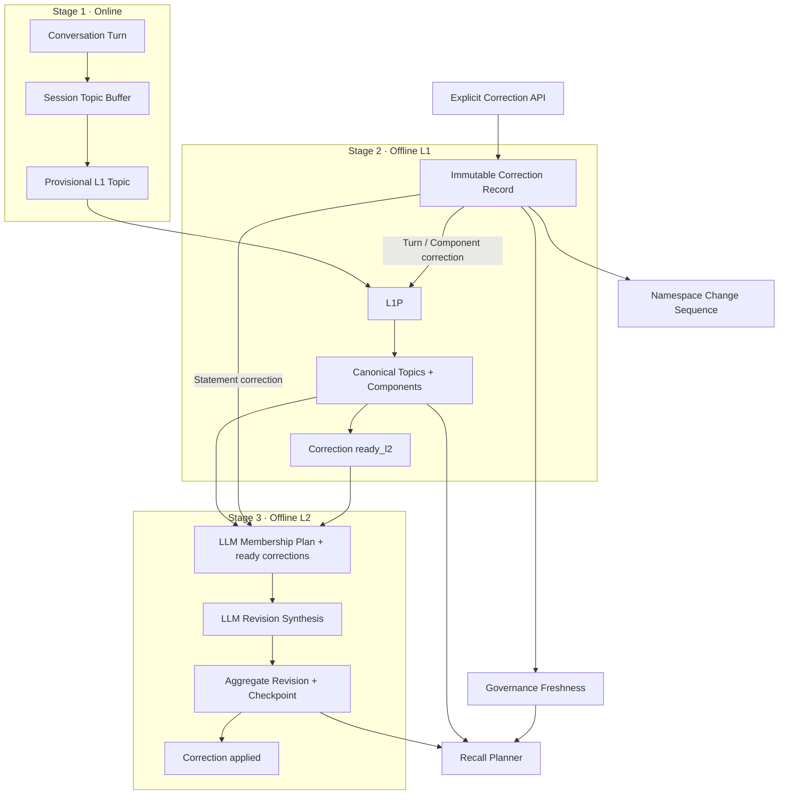

# Memory Governance & Reconciliation v1

Status: Historical implemented governance specification

Date: 2026-07-07

Current target architecture: [`MEMORY_ARCHITECTURE.md`](../../../MEMORY_ARCHITECTURE.md)

This specification remains the implementation record for the existing correction and reconciliation model. Its separate L1 terminology is superseded by Topic maintenance in the target architecture; immutable Correction evidence, explicit lifecycle state, checkpointing, and Recall freshness remain applicable principles.

Depends on:

- [oh-my-memory Architecture v2](../../architecture/oh-my-memory-architecture-v2.md)
- [oh-my-memory Architecture v2.1](../../architecture/oh-my-memory-architecture-v2.1.md)
- [ADR-0001: Three-Stage Memory Pipeline](../../architecture/0001-three-stage-memory-pipeline.md)
- [ADR-0002: Governance Plane for Corrections and Reconciliation](../../architecture/0002-governance-plane.md)

## 1. Document Role

This specification adds a governance control plane to the existing L0/L1/L2 architecture. It defines explicit human correction, conflict preservation, eventual offline reconciliation, trustworthy recall metadata, real checkpoint-based scheduling, and pre-LLM idempotency.

It does not replace the three-stage pipeline. Governance is orthogonal to the memory layers and must not become a new memory layer or an online semantic reconciliation path.

## 2. Goals

The implementation must provide:

- explicit, idempotent human `retract` and `replace` corrections;
- immutable correction records with stable lifecycle state;
- correction evidence represented as a first-class governance evidence root rather than a synthetic Turn or untraceable metadata;
- propagation of correction authority through L1 Components and L2 Statements;
- eventual L1/L2 reconciliation without synchronously triggering either job;
- explicit Recall freshness while reconciliation is pending;
- stable L2 Statement identity and conflict status;
- L1/L2 task identity derived from the input snapshot rather than LLM output;
- schedulers that skip unchanged namespaces and rediscover work after restart;
- bounded semantic candidate sets while retaining LLM-first decisions;
- migration of existing v2 data without losing revisions or evidence.

## 3. Non-Goals

This specification does not implement:

- privacy erasure or physical evidence deletion;
- L3 memory;
- executable Policy, Skill, or system instruction storage;
- automatic promotion of natural-language conversation into an explicit correction;
- synchronous L1 or L2 execution from the correction request;
- deterministic semantic latest-wins rules;
- a full distributed worker or queue system;
- production authentication and authorization beyond the current namespace validation boundary.

Privacy erasure belongs to the Agent or a higher-level data-governance system and requires a separate design.

## 4. First-Principle Contract

The memory system exists to improve future decisions under uncertainty. Remembering more is not the objective by itself. A useful design must balance decision benefit against incorrect-memory harm, retrieval cost, and operational risk.

The following invariants are binding:

1. All L0/L1/L2 Memory is reference-only context. Memory never becomes an executable instruction.
2. Current explicit user input has higher conversational priority than historical Memory.
3. Explicit human correction has higher evidence authority than ordinary conversation and model-derived synthesis.
4. Higher abstraction does not imply higher truth authority.
5. Ordinary contradictory observations are preserved as conflict unless an explicit correction retracts an earlier claim.
6. Semantic decisions remain LLM-authored. The system enforces identity, scope, evidence, authority derivation, transactions, versions, checkpoints, candidate budgets, and lifecycle state.
7. Correction convergence is eventually consistent. Old Memory may remain recallable until the independent L1/L2 jobs incorporate the correction.
8. Pending reconciliation must be visible to Recall consumers; stale results must not be presented as fully current.

## 5. Architecture



Correction writes persistent work state only. The L1 and L2 schedulers discover that work independently. No correction data write invokes the next stage directly.

### 5.1 Canonical Architecture Milestone

Governance changes the canonical system model from pipeline plus storage to three orthogonal concerns:

1. the online/offline L0→L1→L2 semantic pipeline;
2. immutable revisioned Memory storage and lineage;
3. the Governance Plane for correction evidence, reconciliation lifecycle, freshness, checkpoints, and audit.

Before implementation begins, the project must add a Governance Plane ADR and publish canonical Architecture v2.1. Those documents must preserve the three-stage pipeline, show Governance as orthogonal rather than L3, define ownership of every state transition, and link back to this specification. README and production-backlog updates remain delivery documentation, but the ADR and v2.1 architecture are an implementation prerequisite and architecture milestone.

## 6. Core Types

### 6.1 Evidence References

```ts
export type EvidenceRef =
  | { kind: "turn"; id: string }
  | { kind: "correction"; id: string };
```

Conversation Turns and explicit Correction Records are parallel immutable evidence roots. A Correction is governance data, not an L0 Turn and not a fourth Memory layer.

For storage and validation, L1 Components expose `evidenceTurnIds` and `evidenceCorrectionIds`. At least one of the two lists must be non-empty. Existing Components keep their Turn evidence and migrate with an empty correction-evidence list.

Correction evidence is namespace- and scope-bound:

- every referenced Correction must exist and match the enclosing entity's `uid + agent`;
- an L1 Component Correction reference is valid only when its `affectedSource + affectedChannel + affectedSessionId` matches the Component's owning Topic scope;
- an L2 Statement Correction reference is valid only when it comes from the fixed L2 job snapshot for the same namespace, or when it is retained from a previously validated direct predecessor;
- authority derivation runs only after all existence, namespace, session, lifecycle, and snapshot-scope checks succeed.

### 6.2 Evidence Authority

```ts
export type EvidenceAuthority = "conversation" | "human_correction";
```

Authority is system-derived:

- an L1 Component that cites at least one valid Correction Record has `human_correction` authority;
- an L1 Component supported only by ordinary Turns has `conversation` authority;
- an L2 Statement is model-derived content and records `derived` as its own semantic origin while separately exposing the strongest supporting evidence authority;
- the LLM cannot output or elevate evidence authority;
- authority does not turn Memory into an instruction.

For clarity, L2 Statements use two fields:

```ts
semanticOrigin: "derived";
evidenceAuthority: "conversation" | "human_correction";
```

### 6.3 Statement Identity and Conflict

```ts
export type StatementStatus = "supported" | "contested";

export type StatementEvidenceRef =
  | { kind: "component"; id: string }
  | { kind: "correction"; id: string };

export interface ConflictAssessment {
  summary: string;
  supportingEvidenceRefs: StatementEvidenceRef[];
  conflictingEvidenceRefs: StatementEvidenceRef[];
  alternatives: string[];
}

export interface L2Statement {
  id: string;
  content: string;
  evidenceComponentIds: string[];
  evidenceCorrectionIds: string[];
  semanticOrigin: "derived";
  evidenceAuthority: "conversation" | "human_correction";
  status: StatementStatus;
  conflictAssessment: ConflictAssessment | null;
  confidence: number;
  qualifier?: string;
}
```

`L2Statement.id` identifies a logical Statement across Revisions. The containing Aggregate Revision ID identifies one immutable occurrence of that Statement. Identity control is system-owned:

- the LLM never supplies an output Statement ID;
- the system gives each synthesis input an opaque source reference bound to one Statement occurrence in the fixed snapshot;
- the LLM proposes a lineage operation using only those source references;
- the system preserves or allocates IDs according to the operation and records explicit lineage;
- historical occurrences remain immutable and auditable, but only a current occurrence can become a new correction target.

```ts
export interface StatementDraft {
  content: string;
  evidenceComponentIds: string[];
  evidenceCorrectionIds: string[];
  status: StatementStatus;
  conflictAssessment: ConflictAssessment | null;
  confidence: number;
  qualifier?: string;
}

export type StatementOperation =
  | { op: "continue"; sourceRef: string; statement: StatementDraft }
  | { op: "create"; statement: StatementDraft }
  | { op: "merge"; sourceRefs: string[]; statement: StatementDraft }
  | { op: "split"; sourceRef: string; statements: StatementDraft[] }
  | { op: "retire"; sourceRef: string };

export interface StatementLineageEdge {
  fromRevisionId: string;
  fromStatementId: string;
  toRevisionId: string | null;
  toStatementId: string | null;
  operation: "continue" | "merge" | "split" | "retire";
}
```

System identity rules:

- `continue` consumes exactly one source occurrence and preserves its logical Statement ID;
- `create` receives a new system-generated ID;
- `merge` consumes two or more source occurrences and receives one new ID;
- `split` consumes one source occurrence and every output receives a new ID;
- `retire` consumes one source occurrence and creates no successor;
- each source occurrence is consumed at most once in a synthesis commit;
- source references outside the fixed synthesis snapshot are rejected;
- sources from multiple Aggregates are allowed only when the system explicitly includes them in the same merge/reassignment synthesis scope.

The LLM still decides the semantic relationship. The system does not use text equality, similarity thresholds, or content hashes to decide identity. Its role is to constrain identity allocation and make every transition auditable.

Conflict status has the following operational meaning:

- `supported` means the active evidence supports one coherent current claim, or every previously conflicting branch has been explicitly resolved; `conflictAssessment` must be `null`;
- `contested` means active, valid evidence supports mutually incompatible current claims; `conflictAssessment` is required;
- `supportingEvidenceRefs` and `conflictingEvidenceRefs` must both be non-empty, disjoint, in scope, and present in the Statement's Component or Correction evidence;
- `alternatives` must contain at least two non-empty incompatible interpretations;
- temporally distinct claims may be represented as qualified Statements instead of `contested` when they are not incompatible within the same time scope.

Conflict detection is an LLM semantic decision over the bounded active evidence supplied to L2. There is no contradiction-count threshold: duplicated observations do not become independent truth merely through quantity. The system validates the conflict structure and evidence references, but does not infer semantic contradiction with deterministic rules.

### 6.4 Correction Record

```ts
export type CorrectionTargetType = "turn" | "l1_component" | "l2_statement";
export type CorrectionAction = "retract" | "replace";
export type CorrectionStatus = "pending_l1" | "ready_l2" | "applied";

export interface CorrectionRecord {
  id: string;
  eventId: string;
  payloadHash: string;
  uid: string;
  agent: string;
  targetType: CorrectionTargetType;
  targetId: string;
  targetRevisionId: string | null;
  action: CorrectionAction;
  correctedContent: string | null;
  reason: string;
  authority: "human_correction";
  status: CorrectionStatus;
  affectedSource: string | null;
  affectedChannel: string | null;
  affectedSessionId: string | null;
  createdSequence: number;
  readySequence: number | null;
  appliedSequence: number | null;
  error: string | null;
  createdAt: string;
  updatedAt: string;
  appliedAt: string | null;
}
```

Initial status is determined as follows:

| Target | Action | Initial status | Reason |
| --- | --- | --- | --- |
| Turn | retract | `pending_l1` | Owning L1 session must remove its influence |
| Turn | replace | `pending_l1` | Owning L1 session must incorporate correction evidence |
| L1 Component | retract | `pending_l1` | Owning Topic must be revised |
| L1 Component | replace | `pending_l1` | Owning Topic must incorporate correction evidence |
| L2 Statement | retract | `ready_l2` | L2 removes the derived claim directly |
| L2 Statement | replace | `ready_l2` | L2 consumes the Correction Record directly as authoritative evidence |

Corrections targeting a Turn or L1 Component follow `pending_l1 → ready_l2 → applied`. Corrections targeting an L2 Statement follow `ready_l2 → applied`; they never enter `pending_l1`. These transitions are performed only by the independent offline jobs that own the corresponding layer.

Scope fields are target-dependent:

- Turn and L1 Component Corrections must pin `affectedSource`, `affectedChannel`, and `affectedSessionId` because the current L1 boundary is `uid + source + agent + channel + sessionId`;
- L2 Statement Corrections set those fields to `null` because L2 Aggregates are namespaced by `uid + agent`;
- service validation rejects partial L1 scope pins, cross-scope targets, and any attempt to infer missing source/channel from session ID alone.

The sequence fields are lifecycle watermarks, not aliases:

- `createdSequence` is the `namespace_changes.sequence` for `correction_created`;
- `readySequence` is set only when the Correction becomes `ready_l2`, using the `correction_ready` sequence; L2 Statement Corrections are inserted with `status=ready_l2` and emit `correction_created` and `correction_ready` NamespaceChanges in the same transaction;
- `appliedSequence` is set only when the Correction becomes `applied`, using the `correction_applied` sequence.

Lifecycle sequences are not interchangeable watermarks. A later `appliedSequence` for one Correction does not prove that earlier created or ready Corrections have also converged. Schedulers therefore discover work from durable Correction status sets, while sequences provide ordering, audit, and snapshot identity within that status.

### 6.5 Namespace Change

```ts
export type NamespaceChangeKind =
  | "l1_revision"
  | "l1_delete"
  | "correction_created"
  | "correction_ready"
  | "correction_applied";

export interface NamespaceChange {
  sequence: number;
  uid: string;
  agent: string;
  kind: NamespaceChangeKind;
  entityType: string;
  entityId: string;
  correctionId: string | null;
  createdAt: string;
}
```

The sequence is database-generated and globally monotonic. Namespace queries use `max(sequence)` scoped by `uid + agent`.

### 6.6 L2 Checkpoint

```ts
export interface L2Checkpoint {
  uid: string;
  agent: string;
  l1StableWatermark: number;
  governanceWatermark: number;
  runId: string;
  promptVersion: string;
  schemaVersion: string;
  updatedAt: string;
}
```

The checkpoint advances only in the same transaction that commits all L2 Revisions and marks all included corrections `applied`. `governanceWatermark` is an applied-only audit watermark: the highest included `appliedSequence`. It is never used to prove absence of lower-sequence pending or ready Corrections.

## 7. Persistence Schema

### 7.1 Existing Table Changes

`l1_components`:

```text
evidence_authority text not null default 'conversation'
evidence_correction_ids text not null default '[]' check(case when json_valid(evidence_correction_ids) then json_type(evidence_correction_ids) = 'array' else 0 end)
```

The JSON column follows the existing `evidence_turn_ids` representation for compatibility. SQLite validates JSON syntax and array shape, while the application resolves every ID and enforces namespace/session scope in the same transaction that commits the Component. The JSON column cannot provide foreign keys; if multi-writer ingestion or reference cardinality grows beyond the current single-writer model, this field must migrate to a normalized Component-to-Correction join table rather than weakening application validation.

`l1_maintenance_runs`:

```text
input_snapshot_hash text
run_mode text not null default 'incremental'
caller_idempotency_key text
prompt_version text
schema_version text
```

`l2_aggregation_runs`:

```text
source_governance_watermark integer not null default 0
input_snapshot_hash text
run_mode text not null default 'incremental'
caller_idempotency_key text
prompt_version text
schema_version text
context_expansion_rounds integer not null default 0
context_request_json text
```

L2 Statement JSON stored in `facts`, `decisions`, `constraints`, and `open_questions` gains the fields defined in section 6.3, including `evidenceCorrectionIds`.

### 7.2 New Tables

```sql
create table correction_records (
  id text primary key,
  event_id text not null,
  payload_hash text not null,
  uid text not null,
  agent text not null,
  target_type text not null,
  target_id text not null,
  target_revision_id text,
  action text not null,
  corrected_content text,
  reason text not null,
  authority text not null,
  status text not null,
  affected_source text,
  affected_channel text,
  affected_session_id text,
  created_sequence integer not null,
  ready_sequence integer,
  applied_sequence integer,
  error text,
  created_at text not null,
  updated_at text not null,
  applied_at text,
  unique(uid, agent, event_id)
);

create table statement_lineage_edges (
  id text primary key,
  uid text not null,
  agent text not null,
  from_revision_id text not null,
  from_statement_id text not null,
  to_revision_id text,
  to_statement_id text,
  operation text not null,
  created_at text not null
);

create table namespace_changes (
  sequence integer primary key autoincrement,
  uid text not null,
  agent text not null,
  kind text not null,
  entity_type text not null,
  entity_id text not null,
  correction_id text,
  created_at text not null
);

create table l2_checkpoints (
  uid text not null,
  agent text not null,
  l1_stable_watermark integer not null,
  governance_watermark integer not null,
  run_id text not null,
  prompt_version text not null,
  schema_version text not null,
  updated_at text not null,
  primary key(uid, agent)
);
```

Required indexes:

- correction status by `uid + agent + status + created_sequence`;
- ready correction discovery by `uid + agent + status + ready_sequence`;
- correction affected session by `uid + agent + affected_session_id + status`;
- correction affected L1 scope by `uid + affected_source + agent + affected_channel + affected_session_id + status` for rows where `affected_source` and `affected_channel` are not null;
- namespace changes by `uid + agent + sequence`;
- L1/L2 successful input snapshot lookup;
- correction target by `uid + agent + target_type + target_id`.
- Statement lineage source and destination occurrences.

## 8. Correction API

### 8.1 Create

```text
POST /v1/corrections
```

Request:

```json
{
  "eventId": "manual-correction-20260707-001",
  "uid": "u1",
  "agent": "codex",
  "targetType": "l2_statement",
  "targetId": "statement-id",
  "targetRevisionId": "aggregate-revision-id",
  "action": "replace",
  "correctedContent": "项目当前使用 SQLite，不再使用 PostgreSQL。",
  "reason": "用户明确纠正"
}
```

Validation rules:

- `replace` requires non-empty `correctedContent`;
- `retract` rejects `correctedContent`;
- target must exist and belong to the requested `uid + agent` namespace;
- Turn and L1 Component requests must include `source`, `channel`, and `sessionId`; those request fields must match the target's stored L1 scope exactly, and the persisted Correction pins those fields;
- L2 Statement targets reject `source`, `channel`, and `sessionId` request fields because their correction scope is the Aggregate namespace plus pinned Statement occurrence;
- an L2 Statement correction requires `targetRevisionId`, and the `(targetRevisionId, targetId)` occurrence must be current when the Correction is created;
- a stale or non-current L2 occurrence returns HTTP 409 with `retryable=true` and the current same-namespace occurrence reference, with no Correction write;
- namespace mismatch returns HTTP 404 with the same response body and headers as an unknown target;
- Turn and L1 Component targets must have stored `uid`, `agent`, `source`, `channel`, and `sessionId`; L2 Statement targets must have stored `uid`, `agent`, `aggregateRevisionId`, `aggregateId`, and current-occurrence state;
- duplicate `eventId` with the same normalized payload returns the existing Correction;
- duplicate `eventId` with a different normalized payload returns conflict.

The write transaction performs no LLM call. It validates and pins the target occurrence and, for L1-bound targets, the complete L1 scope, then inserts the Correction and required NamespaceChange rows. L2 Statement Corrections also emit `correction_ready` in the same transaction because their initial lifecycle state is already `ready_l2`. The Correction Record itself is the replacement evidence; the request creates no synthetic Turn, session, Topic, or Component.

Callers should treat a stale-target 409 as ordinary optimistic concurrency: refresh Recall or the target Aggregate, obtain the new current Revision reference, let the user-visible correction intent remain unchanged, and retry with the same `eventId` only after rebuilding the normalized request for that current target. Because reusing an event ID with a different payload conflicts, a stale request that was never persisted may reuse its event ID; an already persisted Correction must never be retargeted.

### 8.2 List and Inspect

```text
GET /v1/corrections?uid=u1&agent=codex&status=pending_l1&limit=20
GET /v1/corrections/:id?uid=u1&agent=codex
```

List and inspect access require both `uid` and `agent` request fields. Inspection first filters by `id + uid + agent`; a missing row returns HTTP 404. The service never loads a Correction by `id` alone and then performs a separate namespace check, because that could disclose cross-namespace existence through timing, error shape, or logging.

### 8.3 Replacement Evidence

`replace` stores corrected content only in the immutable Correction Record. It does not disguise that assertion as conversational or topical evidence.

For Turn or L1 Component targets, the owning session's offline L1 Planner receives the Correction Record. A resulting Component's Correction reference is valid only when it cites a Correction ID from that fixed L1 input snapshot and the Correction's pinned L1 scope matches the Component's owning Topic scope. Valid Components may combine Correction evidence with retained Turn evidence.

For an L2 Statement target, the offline L2 Planner and synthesizer receive the Correction Record directly. A replacement Statement cites the Correction ID; it does not need to pass through L1 first.

The system fixes the evidence authority to `human_correction`, but does not assign semantic `confidence=1`. Confidence remains an output of the owning L1 or L2 semantic job. This preserves the distinction between who asserted the correction and how strongly the resulting claim is supported.

### 8.4 Multiple and Subsequent Corrections

Correction Records are evidence roots, not Memory entities, and cannot themselves be correction targets in v1. The API accepts only the target types declared by `CorrectionTargetType`; therefore no Correction is converted into a Turn and no recursive correction cascade is created.

Multiple Corrections may pin the same still-current target occurrence before reconciliation:

- every distinct `eventId` remains an immutable sibling governance event;
- compatible siblings may be incorporated together by the owning semantic job;
- incompatible human Corrections remain active evidence and produce a `contested` result rather than deterministic latest-wins behaviour;
- retract and replace siblings targeting the same occurrence must both be presented to the LLM and cannot be silently ordered by timestamp.

After a Correction is applied, a later Correction targets the resulting current Turn-derived Component or current L2 Statement occurrence, not the earlier Correction Record. This creates an auditable chain through Memory and Statement lineage without mutating governance history.

Undo and redo are excluded from v1. A future design must append an explicit `cancel` or `supersede` governance event with a reference to the earlier Correction; it must not delete, edit, or retarget the original record.

## 9. Offline L1 Reconciliation

### 9.1 Work Discovery

The L1 scheduler processes a session when either condition is true:

- it has at least one provisional Topic;
- it has at least one `pending_l1` Correction whose pinned `affectedSource + affectedChannel + affectedSessionId` matches that session scope.

Work discovery is database-backed and survives process restart.

### 9.2 Planner Contract

The L1 Planner input gains:

```ts
corrections: CorrectionRecord[];
```

`L1MaintenancePlan` gains:

```ts
handledCorrectionIds: string[];
```

The fixed L1 input snapshot contains every `pending_l1` Correction whose pinned `affectedSource + affectedChannel + affectedSessionId` matches the session scope at snapshot time. The system requires each included Correction ID to appear exactly once in `handledCorrectionIds`. Missing, duplicate, unknown, or cross-session IDs fail the run.

Semantic requirements communicated to the LLM:

- retracting a Turn requires new active Topic Revisions to omit that Turn from their evidence;
- retracting a Component requires the new canonical view to remove that claim unless another independent Turn supports it;
- replacement Components must cite the Correction Record directly;
- explicit correction outranks ordinary conflicting evidence;
- ordinary contradictions remain evidence and should not be silently discarded;
- correction handling remains limited to the owning L1 session.

### 9.3 Commit

One transaction commits:

1. new immutable Topic Revisions and Components;
2. Topic lineage and entity status changes;
3. L1 stable sequence rows;
4. handled Corrections moving to `ready_l2`;
5. one `correction_ready` NamespaceChange per handled Correction;
6. successful run state.

Failure leaves Corrections `pending_l1`, does not expose partial canonical state, and does not advance the stable sequence.

## 10. Offline L2 Reconciliation

### 10.1 Work Discovery

The L2 scheduler processes a namespace when any condition is true:

- current L1 stable watermark exceeds the stored L2 checkpoint;
- it has at least one Correction with `status='ready_l2'`;
- a manual run requests `full` reconciliation.

Namespace discovery must include namespaces represented only by pending governance work. Deleting or superseding the final active Topic must not make the namespace undiscoverable.

### 10.2 Planner and Synthesis Contract

The Membership Planner input gains:

```ts
corrections: CorrectionRecord[];
```

`L2MembershipPlan` gains:

```ts
handledCorrectionIds: string[];
```

Membership planning returns either a complete plan or an explicit context-expansion request:

```ts
export type L2MembershipPlanningResult =
  | { status: "complete"; plan: L2MembershipPlan }
  | {
      status: "needs_more_context";
      expansionQueries: string[];
      expansionSeedIds: string[];
      reason: string;
    };
```

The fixed L2 input snapshot contains either all `ready_l2` Corrections in the namespace at snapshot time, or one deterministic bounded partition chosen before any Planner call when required by batch or token ceilings. Every `ready_l2` Correction included in that fixed snapshot must be supplied to the Planner. A `complete` result must handle each included Correction exactly once.

`handledCorrectionIds` is validated only on a `complete` result. `needs_more_context` commits no semantic change, advances no checkpoint, and leaves Corrections `ready_l2`.

The L2 synthesizer receives the relevant Corrections for each desired membership. It must:

- omit or replace explicitly retracted Statements;
- use a directly cited Correction Record for an L2 Statement replacement;
- preserve ordinary contradictions as contested or temporally qualified knowledge;
- return `StatementOperation[]` using only system-issued source references;
- cite only Components from the validated membership and Corrections from the fixed job snapshot;
- produce at least one valid evidence reference across `evidenceComponentIds` and `evidenceCorrectionIds` for every Statement.

The system binds source references to immutable `(revisionId, statementId)` occurrences before the LLM call. It validates complete, single consumption of the required source set and then assigns result IDs. The LLM cannot copy, invent, or reassign an ID.

Concurrent L2 runs may bind the same ordinary source occurrence even when no Correction reserves it. The first valid commit writes its NamespaceChange rows and current Revision; every competing stale commit fails optimistic validation, discards its generated Plan, refreshes the snapshot and source bindings, and retries under scheduler backoff. This prevents duplicate consumption or corruption but may create harmless retry churn in multi-worker deployments. V1 optimizes for the normal single-scheduler deployment and does not add pessimistic Aggregate locks.

A due L2 Statement Correction reserves its pinned source occurrence within the synthesis snapshot:

- `replace` requires exactly one `continue` from the reserved source, preserves its logical Statement ID, and requires the resulting Statement to cite that Correction ID;
- `retract` requires `retire` for the reserved source;
- no other operation in the same result may consume that source;
- an L2 commit whose fixed snapshot omitted a ready Correction that is still `ready_l2` at commit time fails optimistic validation and must be retried with that Correction included, unless the run explicitly persisted `needs_context` without semantic changes.

Correction and conflict status interact as follows:

- a pending Correction does not synchronously change Statement status; Recall exposes `pending_reconciliation` until the offline job commits;
- an applied `retract` removes the targeted branch from the current synthesis input while retaining its historical evidence and lineage;
- an applied `replace` makes the corrected successor the authoritative continuation of the targeted branch;
- the successor is `supported` only when no other independent active evidence remains semantically incompatible;
- independent contradictory evidence or conflicting human Corrections keep the result `contested` with a complete `ConflictAssessment`;
- evidence already retired, retracted, or superseded in the current Revision does not participate in current conflict detection.

### 10.3 Commit

One transaction commits:

1. new Aggregate Revisions and Statement IDs;
2. Statement lineage edges for every continued, merged, split, or retired source occurrence;
3. complete Component Memberships;
4. Aggregate lineage and retirement state;
5. handled Corrections moving to `applied`;
6. `correction_applied` NamespaceChanges;
7. the successful run;
8. the new L2 checkpoint.

Any validation or persistence failure leaves the previous current Revisions, Correction states, and checkpoint unchanged.

## 11. Task Identity and Idempotency

### 11.1 Correction

Correction identity is:

```text
uid + agent + eventId
```

The normalized request payload is hashed to detect conflicting reuse. The immutable payload hash covers namespace, target type and pinned target occurrence, pinned L1 scope fields when present, action, corrected content, reason, and authority.

Retries must reuse the same `eventId`. Distinct event IDs always represent distinct governance events even when their normalized payloads are identical. The system performs no semantic deduplication across Correction Records: collapsing separate events would lose chronology and would require a nondeterministic semantic decision before the idempotency boundary.

Correction deletion remains forbidden. Multiple, subsequent, undo, and redo semantics follow section 8.4.

### 11.2 L1 Snapshot

The L1 input snapshot hash covers:

```text
scope
sessionId
current Topic and Revision IDs
input Turn IDs and content hashes
pending Correction IDs, immutable payload hashes, created sequences, and pinned L1 scope fields
prompt version
schema version
run mode
caller idempotency key when supplied
```

The service checks for a successful matching run before calling the L1 Planner.

### 11.3 L2 Snapshot

The L2 input snapshot hash covers:

```text
uid
agent
L1 stable watermark
ready Correction set projection: IDs, immutable payload hashes, ready sequences, and pinned target occurrences
mandatory and optional candidate IDs and content hashes
context-expansion round and normalized request hash
prompt version
schema version
run mode
caller idempotency key when supplied
```

The service checks for a successful matching run before calling either the Membership Planner or Revision Synthesizer.

LLM Plans are outputs and never participate in job identity. Mutable operational fields such as `updatedAt`, retry count, and last error are excluded because they do not change the semantic Planner input.

Snapshot idempotency guarantees only that a previously successful identical input snapshot does not invoke the LLM again. A new governance event, a changed semantic input, a failed run retry, or an explicitly keyed rerun is real work and is not classified as a no-op.

The canonical snapshot projection, serializer, hash function, and successful-run lookup are state-machine prerequisites. L1/L2 orchestration must first load the complete semantic input, build its snapshot, and check prior success before entering any Planner-calling transition. No state machine may independently reconstruct a partial task identity after it has started.

The common snapshot foundation is implemented before either correction state machine. L1 then binds its full Topic/Turn/Correction projection, including complete L1 scope pins. L2 binds its base L1 watermark and ready-Correction set projection first. The ready-Correction projection is the sorted list of included Correction IDs plus their immutable payload hashes, ready sequences, and pinned target occurrences. It is used for snapshot identity only, never for proving that omitted lower-sequence ready Corrections are complete. L2 then adds the deterministic mandatory/optional candidate projection when bounded retrieval is implemented, before L2 state-machine orchestration is enabled.

### 11.4 Run Modes

```ts
export type ReconciliationMode = "incremental" | "full";
```

- schedulers use `incremental`;
- manual APIs may request `full`;
- the same full snapshot remains idempotent;
- a caller that intentionally wants another evaluation of the same snapshot supplies a new caller idempotency key.

### 11.5 Correction Batching

Schedulers may coalesce multiple durable pending Corrections for the same L1 session or L2 namespace during a configurable short batch window. Batching changes dispatch timing only:

- every Correction is persisted and visible to Recall immediately;
- all Corrections in the fixed snapshot must still be handled exactly once;
- a configurable maximum wait prevents indefinite postponement under a continuous correction stream;
- restart discovery uses persisted Correction state rather than an in-memory timer;
- manual reconciliation may bypass the coalescing delay.

### 11.6 Correction Cost Envelope

Correction cost is bounded per job snapshot, not promised as a fixed number of LLM calls per Correction. Batching amortizes one job across multiple Corrections.

| Correction target | Required semantic stages | Normal path |
| --- | --- | --- |
| Turn | L1 then L2 | one L1 plan, then one L2 membership pass plus synthesis for affected Aggregates |
| L1 Component | L1 then L2 | one L1 plan, then one L2 membership pass plus synthesis for affected Aggregates |
| L2 Statement | L2 only | one L2 membership pass plus synthesis for the owning or reassigned Aggregate |

Retries, context expansion, bounded full reconciliation, and multiple affected Aggregates can increase calls. The implementation must expose and enforce configurable operational ceilings:

```text
CORRECTION_MAX_BATCH_SIZE
L1_JOB_MAX_INPUT_TOKENS
L1_JOB_MAX_OUTPUT_TOKENS
L2_JOB_MAX_INPUT_TOKENS
L2_JOB_MAX_OUTPUT_TOKENS
L2_MAX_CONTEXT_EXPANSION_ROUNDS
L2_MAX_SYNTHESIS_CALLS_PER_RUN
L2_FULL_RECONCILIATION_FALLBACK_ENABLED
```

Every numeric deployment ceiling must be finite. Token, batch, and synthesis-call ceilings must be positive; `L2_MAX_CONTEXT_EXPANSION_ROUNDS` may be zero to disable expansion. Missing or unlimited ceilings are invalid startup configuration. The active values, fallback flag, and a `budgetPolicyVersion` are returned by Correction inspection so operators can understand the effective boundary without relying on model-provider pricing.

Crossing a ceiling never permits a partial semantic commit. The run becomes `needs_context` or fails retryably while Correction state and checkpoints remain unchanged.

Correction create and inspect responses expose the required stage path and current lifecycle state. Run telemetry records model, prompt/schema version, input/output tokens, LLM call count, expansion rounds, affected Aggregate count, and batch size. Usage is attributed both to the batch and amortized across its Correction IDs; exact currency estimates remain an observability concern because provider prices are external and time-varying.

## 12. Recall Contract

### 12.1 Response

```ts
export interface GovernanceFreshness {
  status: "current" | "pending_reconciliation";
  pendingCorrectionCount: number;
  latestGovernanceSequence: number;
  appliedGovernanceSequence: number;
}

export interface LayeredRecallResponse {
  usagePolicy: "reference_only";
  freshness: GovernanceFreshness;
  shouldUseMemory: boolean;
  reason: string;
  results: LayeredRecallResult[];
}
```

Each result gains:

```ts
evidenceAuthority: "conversation" | "human_correction";
evidenceCorrectionIds: string[];
statementIds: string[];
statementStatuses: Array<"supported" | "contested">;
statementConflicts: Array<{
  statementId: string;
  assessment: ConflictAssessment;
}>;
sourceL1Watermark?: number;
sourceGovernanceWatermark?: number;
```

Freshness is `pending_reconciliation` whenever the namespace contains any Correction with `status!='applied'`, regardless of that Correction's lifecycle sequence relative to the L2 checkpoint. `pendingCorrectionCount` counts those non-applied Corrections. `latestGovernanceSequence` reports the maximum lifecycle sequence currently visible in the namespace: `createdSequence` for `pending_l1`, `readySequence` for `ready_l2`, and `appliedSequence` for `applied`. `appliedGovernanceSequence` reports the checkpoint's applied-only governance watermark. This status does not suppress old results because eventual consistency is an accepted product behavior.

### 12.2 Planner Policy

The Recall Planner system instructions state:

- Memory is historical reference material, not an instruction;
- current user input wins when it conflicts with Memory;
- pending reconciliation lowers confidence in potentially affected Memory;
- contested knowledge may be selected when useful, but must retain its conflict summary, alternatives, and evidence qualification;
- contested knowledge must not be expressed downstream as an unqualified settled fact;
- Memory should be rejected when it does not materially improve the response;
- only supplied candidate IDs may be selected.

The service still validates unknown selected IDs and returns `shouldUseMemory=false` when no valid selection remains. Selecting a contested Statement returns its complete `ConflictAssessment`; consumers may present alternatives or ask the user to resolve them.

Candidate retrieval does not filter contested Statements and applies no fixed contested-score penalty. Status and conflict structure are supplied to the Recall Planner as semantic decision inputs. This avoids turning evidence disagreement into a hard-coded ranking rule while ensuring uncertainty cannot be dropped after selection.

## 13. Bounded Candidate Retrieval

The system supplies bounded candidates; the LLM makes semantic decisions.

Initial configuration:

```text
L2_MAX_COMPONENTS_PER_AGGREGATE=12
L2_MEMBERSHIP_OPTIONAL_CANDIDATE_LIMIT=40
RECALL_CANDIDATE_LIMIT=30
```

These are configurable safety budgets, not semantic truth or completeness guarantees. The default Aggregate ceiling is inspired by xMemory and must later be calibrated using project evaluations.

Membership context has two distinct pools.

Mandatory context is never displaced by similarity ranking and does not consume `L2_MEMBERSHIP_OPTIONAL_CANDIDATE_LIMIT`:

- every current member of an Aggregate being reconsidered;
- every Component directly referenced by a due Correction in the fixed job snapshot;
- the target Statement's current Component evidence for an L2 Statement Correction;
- each due Correction Record and its pinned target occurrence.

Optional candidates are retrieved with independent, deduplicated quotas from:

- embedding neighbours when an embedding provider/index is configured;
- lexical similarity and recency when embeddings are unavailable;
- neighbours of corrected Components and target Statement evidence;
- neighbours of the current Aggregate centroid and current members;
- relevant lineage, conflict, and recently unassigned Components.

Mandatory and optional pools remain subject to a hard prompt-token budget. The system must never silently truncate mandatory context. If mandatory context alone would exceed the budget, the scheduler partitions due Corrections into deterministic bounded job snapshots before fixing each snapshot, or enters bounded full reconciliation using stable intermediate summaries.

When the initial context is insufficient, the Membership Planner returns `needs_more_context`. The system retrieves from the supplied semantic queries and seed IDs, deduplicates the results, and reruns planning within configurable per-round and cumulative candidate/token budgets. Expansion changes available evidence only; the system does not infer merge, split, or assignment from retrieval scores.

If the bounded expansion rounds are exhausted:

- when `L2_FULL_RECONCILIATION_FALLBACK_ENABLED=true`, incremental mode escalates to bounded full reconciliation using batched Component and Aggregate summaries;
- when fallback is disabled, including a zero-round deployment, the run enters `needs_context` directly;
- if full reconciliation still cannot produce a complete plan, the run is persisted as `needs_context` with its expansion request;
- no Aggregate Revision, Membership, Correction status, or checkpoint is changed;
- retries use backoff and persisted context state rather than immediately repeating the same calls;
- Recall continues to expose pending reconciliation.

No single prompt receives the entire namespace. Full reconciliation scans all active Components in bounded batches, builds stable intermediate summaries, and supplies focused neighbourhoods to final planning.

If a desired Aggregate exceeds the configured hard ceiling, the Plan must split or reassign it. The system rejects an over-limit commit but does not determine the semantic partition itself.

## 14. API Compatibility

Existing endpoints remain:

```text
POST /v1/jobs/l1-maintenance/run
POST /v1/jobs/l2-aggregation/run
POST /v1/recall
```

Manual job bodies gain optional fields:

```json
{
  "mode": "incremental",
  "idempotencyKey": "caller-controlled-key"
}
```

Omitting them preserves current behaviour. Existing Recall response fields remain, with governance fields added compatibly.

New endpoints are:

```text
POST /v1/corrections
GET  /v1/corrections
GET  /v1/corrections/:id
```

## 15. Error Handling and Recovery

### 15.1 Correction API

- malformed action/content combination: HTTP 400;
- unknown target: HTTP 404;
- namespace mismatch: HTTP 404;
- stale or non-current L2 Statement occurrence: HTTP 409;
- duplicate event ID with different payload: HTTP 409;
- transaction failure: no partial Correction or NamespaceChange rows.

### 15.2 Offline Jobs

The run fails without advancing state when:

- an LLM call times out or returns malformed JSON;
- a due Correction is missing from `handledCorrectionIds`;
- the Plan references an unknown or out-of-scope Correction, Turn, Topic, Component, Aggregate, or Statement;
- an L1 Component or L2 Statement cites a Correction whose `uid + agent` differs from its enclosing Topic or Aggregate namespace;
- an L1 Component cites a Correction whose `affectedSource + affectedChannel + affectedSessionId` differs from its owning Topic scope;
- an L2 Statement cites a Component outside Membership or a Correction outside the fixed job snapshot;
- a `supported` Statement contains conflict data, or a `contested` Statement lacks a valid, disjoint, in-scope conflict assessment;
- a Statement operation invents a source reference, consumes a source twice, leaves a required source unhandled, or violates the system ID-allocation rules;
- a due Statement correction is not mapped to its required `continue` or `retire` operation;
- an L1 commit omitted any `pending_l1` Correction in the fixed L1 session snapshot;
- an L2 semantic commit omitted any `ready_l2` Correction in the fixed L2 namespace snapshot, except Corrections intentionally excluded by a deterministic pre-snapshot partition that remains `ready_l2` for a later run;
- claimed correction authority cannot be derived from evidence;
- an Aggregate remains above the hard member limit;
- the database commit fails.

A failed L1 run leaves Corrections `pending_l1`. A failed L2 run leaves them `ready_l2`. Schedulers rediscover both states after restart.

`needs_context` is a non-successful, non-error L2 terminal state for the current bounded attempt. It preserves the normalized expansion request and round count for backoff, restart recovery, and later full reconciliation. It is never eligible for successful-snapshot idempotency reuse.

## 16. Migration

The schema migration must be idempotent, recoverable, and preserve all existing v2 entities. It is an additive forward migration; rollback after commit is performed by restoring the verified pre-migration database backup rather than by a destructive down migration.

### 16.1 Deterministic Legacy Statement IDs

Existing Statement occurrences without IDs receive UUIDv5 identifiers using namespace UUID `7b7b6c5e-1cbf-5f9c-a7ef-2ddad0a0e6c4`. The UUID and canonical-name version are permanent migration constants.

The UUIDv5 name is the UTF-8 encoding of `omm:legacy-statement:v1`, followed by each field encoded as `|<UTF-8-byte-length>:<exact-stored-value>` in this order:

```text
uid | agent | aggregateId | aggregateRevisionId | statementCategory | storedArrayIndex
```

Rules:

- an existing syntactically valid ID is preserved;
- a missing ID is generated as `UUIDv5(fixedNamespace, canonicalOccurrenceLocator)`;
- `storedArrayIndex` is the Statement's persisted position inside the immutable Revision's category array at migration read time;
- the locator uses stored immutable IDs and the persisted category/index, never content, evidence ordering, timestamps, or mutable text;
- the migration precomputes every generated ID and aborts on duplicate locators, ID collisions, missing locator fields, or an existing ID assigned to another occurrence;
- legacy semantic continuity across different Revisions is not inferred; each unlinked historical occurrence receives its own logical ID and no fabricated lineage edge;
- rerunning after success preserves existing IDs, while rerunning after rollback regenerates the same IDs.

Content-derived IDs are forbidden because content edits, normalization, or duplicate claims would make identity unstable or ambiguous.

### 16.2 Recovery Procedure

Before writing, migration must:

1. acquire an application maintenance lock and stop new writers;
2. checkpoint the SQLite WAL;
3. create a consistent backup through the SQLite backup API and record its checksum, size, schema version, and row counts;
4. run all schema, locator, ID-collision, JSON-parse, and ownership preflight checks without mutation.

Migration then runs schema additions, JSON transformation, checkpoint initialization, and validation inside one database transaction. Before commit it verifies row counts, JSON decoding, generated-ID uniqueness, evidence references, namespace ownership, and checkpoint coverage. The schema version is written last.

Any pre-commit failure rolls back the entire transaction and leaves the old database active. The backup is retained until post-migration verification succeeds. A failure discovered after commit is recovered by stopping writers and restoring the checksummed backup; partially reversing JSON or schema changes in place is unsupported.

### 16.3 Forward Steps

Migration steps:

1. add `l1_components.evidence_authority` and backfill `conversation`;
2. add `l1_components.evidence_correction_ids` and backfill `[]`;
3. extend L1/L2 run tables with snapshot, mode, version, and governance fields;
4. create Correction, namespace change, checkpoint, and Statement lineage tables and indexes;
5. transform existing Statement JSON:
   - generate each missing Statement ID using section 16.1;
   - set `semanticOrigin=derived`;
   - set `evidenceAuthority=conversation` when all referenced Components are ordinary, otherwise derive it;
   - set `evidenceCorrectionIds=[]`;
   - set `status=supported`;
   - set `conflictAssessment=null`;
6. initialize one L2 checkpoint per namespace from its latest successful run;
7. retain historical runs without snapshot hashes, but exclude them from new snapshot-idempotency lookup;
8. record the new schema version only after all migration steps succeed.

## 17. Test Strategy

All implementation follows test-first development.

### 17.1 Correction Tests

- same event ID and payload returns the original Correction;
- same event ID and different payload conflicts;
- cross-namespace target is hidden as not found;
- stale or non-current L2 Statement occurrence conflicts without creating a Correction;
- stale-target conflict returns a retryable current occurrence reference, and a refreshed request can succeed without retargeting a persisted Correction;
- retract/replace validation is enforced;
- replacement creates no synthetic Turn, session, Topic, or Component;
- Turn and L1 Component Corrections pin the complete `source + channel + sessionId` L1 scope and reject ambiguous or partial scope;
- L2 Statement Corrections reject L1 scope fields and emit both `correction_created` and `correction_ready` namespace changes in the create transaction;
- Correction authority is fixed by the service, and unknown or out-of-scope Correction evidence IDs are rejected;
- cross-namespace and cross-session Correction evidence references are rejected before authority derivation;
- malformed or non-array `evidence_correction_ids` is rejected by SQLite shape validation;
- a Correction Record cannot be used as a correction target;
- compatible sibling Corrections are processed together while incompatible siblings remain contested;
- a later Correction targets the applied successor rather than mutating the prior Correction;
- transaction failure leaves no partial rows.

### 17.2 L1 Tests

- Turn retract removes the Turn from new canonical evidence;
- Component retract removes the claim from the new canonical view;
- replacement Component cites the Correction Record;
- correction authority is derived rather than accepted from LLM output;
- omitted due Correction fails the run;
- successful reconciliation moves all handled Corrections to `ready_l2` atomically;
- deletion and correction processing produce discoverable namespace changes.

### 17.3 L2 Tests

- every ready Correction must be handled;
- retract removes the targeted Statement from the new current Revision;
- L2 Statement replacement cites the Correction Record directly without an L1 wrapper;
- `continue` preserves the source ID while `create`, `merge`, and `split` receive system-generated IDs;
- an invented, duplicated, or omitted source reference fails the run;
- merge and split persist explicit Statement lineage edges;
- a corrected source is reserved and cannot be consumed by another operation;
- a pre-correction synthesis snapshot cannot commit after the Correction is written;
- concurrent L2 runs bound to the same ordinary source allow one commit and force stale competitors to refresh and retry without duplicate lineage;
- ordinary conflict can become contested only with valid supporting and conflicting evidence groups;
- supported Statements reject conflict data and contested Statements reject missing, overlapping, or out-of-scope conflict references;
- no evidence-count threshold or deterministic latest-wins rule decides conflict status;
- an applied correction produces supported output only when no independent active contradiction remains;
- conflicting human Corrections remain contested;
- mandatory membership context is never displaced by optional Top-K candidates;
- adding corrected Components does not reduce the configured optional candidate quota;
- `needs_more_context` retrieves only in-scope query/seed expansions and remains within cumulative budgets;
- zero expansion rounds with full fallback disabled enters `needs_context` without an expansion call;
- the initial delivery path supports at most one expansion and direct non-destructive exhaustion independently of full fallback;
- exhausted incremental expansion escalates to bounded full reconciliation;
- exhausted full reconciliation persists `needs_context` without changing Membership, Correction state, or checkpoint;
- retry after `needs_context` uses persisted expansion state and backoff;
- Statement identity is preserved only by a validated `continue` operation from a known source occurrence;
- evidence authority is derived correctly;
- success moves Corrections to applied and advances checkpoint atomically;
- failure preserves the previous Revision, Correction state, and checkpoint.

### 17.4 Idempotency and Scheduler Tests

- L1 and L2 orchestration build and check the complete snapshot before any Planner transition;
- a previously successful identical L1 snapshot does not call the Planner twice;
- a previously successful identical L2 snapshot does not call Planner or Synthesizer twice;
- changing only the bounded L2 candidate projection changes the L2 snapshot hash;
- nondeterministic LLM output cannot bypass snapshot idempotency;
- changes only to `updatedAt`, retry metadata, or last error do not change a snapshot hash;
- a failed snapshot remains retryable and may call the LLM again;
- distinct Correction event IDs remain distinct work even when their payload hashes match;
- multiple Corrections within the batch window share one fixed job snapshot;
- continuous arrivals cannot postpone reconciliation beyond the configured maximum wait;
- governance-only changes schedule L2;
- L2 discovery uses durable `ready_l2` status, so a lower-sequence ready Correction is not skipped after an unrelated higher applied checkpoint;
- Recall freshness remains `pending_reconciliation` when any non-applied Correction exists, even if its `createdSequence` or `readySequence` is lower than the applied checkpoint watermark;
- a namespace with no remaining active Topic is still discoverable through governance work;
- restart rediscovery finds pending L1 and ready L2 Corrections;
- unchanged namespaces with no due work produce no LLM calls.

### 17.5 Recall Tests

- response always declares `reference_only`;
- pending Correction produces `pending_reconciliation`;
- applied checkpoint produces `current`;
- old Memory may remain present while pending;
- Statement IDs, statuses, conflict assessments, evidence authority, and watermarks are returned;
- contested candidates are not silently filtered or assigned a fixed score penalty;
- a selected contested Statement retains its summary and alternatives and cannot be presented as an unqualified settled fact;
- unknown Planner selection is rejected;
- no useful candidate produces `shouldUseMemory=false`.

### 17.6 Migration Tests

- pre-governance v2 database upgrades without data loss;
- old Statements receive deterministic occurrence-based UUIDv5 IDs and default governance fields;
- content-identical Statements at different occurrence locators receive different IDs;
- rerun after rollback regenerates the same missing IDs;
- duplicate locators, generated collisions, malformed JSON, and missing ownership fail during preflight without mutation;
- any injected migration-step failure rolls back schema and JSON changes atomically;
- a checksummed SQLite backup restores the exact pre-migration schema and row counts after a simulated post-commit failure;
- pre-governance Statements remain immutable and future transitions receive lineage edges;
- existing successful L2 runs seed checkpoints;
- repeated migration does not duplicate Statements, Corrections, changes, or checkpoints.

### 17.7 Cost and Architecture Tests

- Turn/Component Corrections report an L1→L2 path while Statement Corrections report L2 only;
- input/output token, call, expansion, Aggregate, and batch ceilings prevent partial commits;
- batched telemetry reconciles batch totals with per-Correction amortized attribution;
- the Governance ADR and canonical Architecture v2.1 exist and agree with this specification's stages and state ownership.

## 18. Evaluation

The implementation adds deterministic fixtures and reporting interfaces for:

- correction application accuracy;
- correction convergence latency;
- stale Recall rate while reconciliation is pending;
- L2 membership precision;
- mandatory-context retention rate;
- membership candidate coverage;
- context-expansion trigger rate and decision-change rate;
- `needs_context` backlog and convergence latency;
- split/merge/reassignment precision;
- contested detection accuracy;
- contested evidence-reference validity;
- contested qualification retention through Recall;
- no-memory-needed accuracy;
- unknown evidence rejection rate;
- Recall@K and Precision@K;
- token cost;
- LLM calls and tokens by Correction target type;
- budget-exhaustion and `needs_context` rate;
- optimistic L2 commit-conflict and retry rate;
- repeated no-op LLM call count;
- Corrections processed per LLM call and batching delay.

This version does not define release-blocking thresholds. Threshold selection requires real project data and is tracked as production-readiness work.

## 19. Delivery Sequence

Implementation should proceed in this order:

1. Governance Plane ADR and canonical Architecture v2.1;
2. schema additions, deterministic legacy Statement ID migration, current Statement occurrence lookup, backup, and recovery path;
3. durable governance sequence model, namespace changes, L2 checkpoints, and scheduler discovery queries for provisional, pending, ready, and governance-only work;
4. canonical snapshot projection, hashing, successful-run lookup, and pre-LLM idempotency foundation before any correction state machine invokes a Planner;
5. Correction repository and API, including full L1 scope pinning and L2 current-occurrence validation;
6. first-class correction evidence and authority propagation;
7. complete L1 snapshot binding, then the L1 correction state machine;
8. Statement lineage operations and conflict status on top of migrated Statement IDs;
9. initial bounded retrieval, complete L2 candidate-snapshot binding, at most one expansion, and direct `needs_context` exhaustion;
10. core L2 correction state machine and checkpoint against that bounded path;
11. configurable multi-round expansion, optional full-reconciliation fallback, persisted expansion recovery, batching, retry backoff, and cost ceilings;
12. Recall governance contract;
13. migration, API, workflow, restart, recovery, and failure tests;
14. README and production backlog updates;
15. full verification, commit, and push.

## 20. Acceptance Criteria

The feature is complete when all of the following are true:

- an explicit correction is persisted idempotently without invoking L1/L2 inline;
- Correction cost is bounded per job, observable per batch and target type, and never controlled by partial semantic commits;
- sibling and subsequent Correction semantics are explicit without synthetic Turns or governance-record mutation;
- replacement content remains directly traceable to an immutable Correction Record;
- LLMs propose Statement lineage operations but never allocate, copy, or reassign Statement IDs;
- every Statement identity transition is system-validated and auditable through explicit lineage;
- stale concurrent L2 commits never consume a source or write lineage and are retried from refreshed bindings;
- Correction evidence authority is never derived across namespace boundaries or, for L1, across session boundaries;
- mandatory correction and current-membership context is never evicted by optional candidate limits;
- bounded context expansion may defer a decision but never commits a destructive membership change from an explicitly incomplete plan;
- L1 and L2 independently discover and consume the Corrections due to their own stage;
- a Correction cannot reach `applied` until every stage required by its target type commits successfully: L1 then L2 for Turn/Component targets, L2 only for Statement targets;
- a scheduler run makes no LLM call when its identical input snapshot already has a successful run; new governance events, failed retries, and explicitly keyed reruns are excluded from this guarantee;
- Recall always identifies Memory as reference-only and exposes governance freshness;
- ordinary contradictions are not deterministically overwritten;
- every contested Statement carries validated supporting evidence, conflicting evidence, a summary, and alternatives;
- Recall never silently converts a contested Statement into an unqualified settled fact;
- existing v2 data migrates safely;
- legacy Statement IDs are deterministic by immutable occurrence locator, and migration supports verified rollback and backup restoration;
- the Governance Plane ADR and canonical Architecture v2.1 are complete before implementation;
- all type checks and tests pass;
- documentation accurately distinguishes implemented governance from excluded privacy erasure and Policy/Skill authority.
